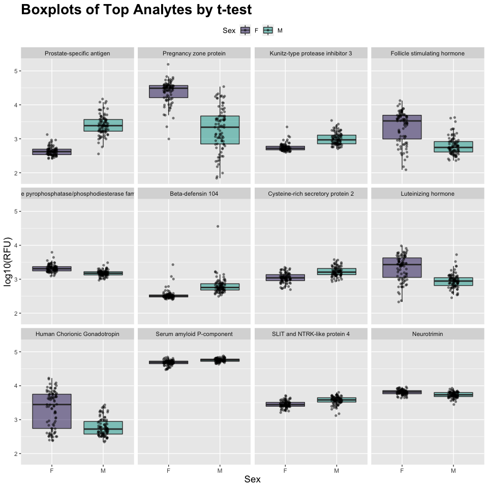

<!-- README.md is generated from README.Rmd. Please edit that file -->

# `SomaDataIO` from SomaLogic Operating Co., Inc. 

<!-- badges: start -->


[](https://cran.r-project.org/package=SomaDataIO)
[](https://cran.r-project.org/package=SomaDataIO)
[](https://github.com/SomaLogic/SomaDataIO/actions)
[](https://app.codecov.io/gh/SomaLogic/SomaDataIO?branch=main)
[](https://lifecycle.r-lib.org/articles/stages.html#stable)
[](https://choosealicense.com/licenses/mit/)
<!-- badges: end -->

## Overview

This document accompanies the `SomaDataIO` R package, which loads and
exports ‘SomaScan’ data via the SomaLogic Operating Co., Inc.
proprietary text file called an ADAT (`*.adat`). The package also
exports auxiliary functions for manipulating, wrangling, and extracting
relevant information from an ADAT object once in memory. Basic
familiarity with the R environment is assumed, as is the ability to
install contributed packages from the Comprehensive R Archive Network
(CRAN).

If you run into any issues/problems with `SomaDataIO` full documentation
of the most recent
[release](https://github.com/SomaLogic/SomaDataIO/releases) can be found
at our [pkgdown](https://somalogic.github.io/SomaDataIO/) website hosted
by [GitHub](https://github.com/SomaLogic/SomaDataIO/). If the issue
persists we encourage you to consult the
[issues](https://github.com/SomaLogic/SomaDataIO/issues/) page and, if
appropriate, submit an issue and/or feature request.

------------------------------------------------------------------------

## Usage

The `SomaDataIO` package is licensed under the
[MIT](https://github.com/SomaLogic/SomaDataIO/blob/main/LICENSE.md)
license and is intended solely for research use only (“RUO”) purposes.
The code contained herein may *not* be used for diagnostic, clinical,
therapeutic, or other commercial purposes.

------------------------------------------------------------------------

## Installation

The easiest way to install `SomaDataIO` is to install directly from
CRAN:

``` r
install.packages("SomaDataIO")
```

Alternatively from GitHub:

``` r
devtools::install_github("SomaLogic/SomaDataIO")
```

which installs the most current “development” version from the
repository `HEAD`. To install the *most recent* release, use:

``` r
devtools::install_github("SomaLogic/SomaDataIO@*release")
```

To install a *specific* tagged release, use:

``` r
devtools::install_github("SomaLogic/SomaDataIO@v5.3.0")
```

#### Package Dependencies

The `SomaDataIO` package was intentionally developed to contain a
limited number of dependencies from CRAN. This makes the package more
stable to external software design changes but also limits its contained
feature set. With this in mind, `SomaDataIO` aims to strike a balance
providing long(er)-term stability and a limited set of features. Below
are the package dependencies (see also the `DESCRIPTION` file):

- `R (>= 4.1.0)`
- `cli`
- `crayon`
- `dplyr`
- `lifecycle`
- `magrittr`
- `readxl`
- `tibble`
- `tidyr`
- `usethis`

#### Biobase

The `Biobase` package is *suggested*, being required by only two
functions, `pivotExpressionSet()` and `adat2eSet()`.
[Biobase](https://www.bioconductor.org/packages/release/bioc/html/Biobase.html)
must be installed separately from
[Bioconductor](https://www.bioconductor.org) by entering the following
from the `R` console:

``` r
if (!requireNamespace("BiocManager", quietly = TRUE)) {
  install.packages("BiocManager")
}
BiocManager::install("Biobase", version = remotes::bioc_version())
```

Information about Bioconductor can be found here:
<https://bioconductor.org/install/>

#### Loading

Upon *successful* installation, load the SomaDataIO as normal:

``` r
library(SomaDataIO)
```

For an index of available commands:

``` r
library(help = SomaDataIO)
```

------------------------------------------------------------------------

## Objects and Data

The `SomaDataIO` package comes with four (4) objects available to users
to run canned examples (or analyses). They can be accessed once
`SomaDataIO` has been attached via `library()`. They are:

- `example_data`: the original ‘SomaScan’ file (`example_data.adat`) can
  be found [here](https://github.com/SomaLogic/SomaLogic-Data) or
  downloaded directly via:

  ``` bash
  wget https://raw.githubusercontent.com/SomaLogic/SomaLogic-Data/master/example_data.adat
  ```

  - it has been replaced by an abbreviated, light-weight version
    containing only the first 10 samples and can be found at:

    ``` r
    system.file("extdata", "example_data10.adat", package = "SomaDataIO")
    ```

- `ex_analytes`: the analyte (feature) variables in `example_data`

- `ex_anno_tbl`: the annotations table associated with `example_data`

- `ex_target_names`: a mapping object for analyte -\> target

- See also `?SomaScanObjects`

------------------------------------------------------------------------

## Main Features (I/O)

- Loading data (Import)
  - parse and import a `*.adat` text file into an `R` session as a
    `soma_adat` object.
- Wrangling data (manipulation)
  - subset, reorder, and list various fields of a `soma_adat` object.
  - `?SeqId` analyte (feature) matching.
  - `dplyr` and `tidyr` verb S3 methods for the `soma_adat` class.
  - `?rownames` helpers that do not break `soma_adat` attributes.
- Exporting data (Output)
  - write out a `soma_adat` object as a `*.adat` text file.

### Loading an ADAT

``` r
# Sample file name
f <- system.file("extdata", "example_data10.adat",
                 package = "SomaDataIO", mustWork = TRUE)
my_adat <- read_adat(f)
is.soma_adat(my_adat)
#> [1] TRUE

# S3 print method forwards -> tibble
my_adat
#> ══ SomaScan Data ════════════════════════════════════════════════════════════════════════════════════
#>      Attributes intact    ✓
#>      Rows                 10
#>      Columns              5318
#>      Clinical Data        34
#>      Features             5284
#> ── Column Meta ──────────────────────────────────────────────────────────────────────────────────────
#> ℹ SeqId, SeqIdVersion, SomaId, TargetFullName, Target, UniProt, EntrezGeneID, EntrezGeneSymbol,
#> ℹ Organism, Units, Type, Dilution, PlateScale_Reference, CalReference, Cal_Example_Adat_Set001,
#> ℹ ColCheck, CalQcRatio_Example_Adat_Set001_170255, QcReference_170255, Cal_Example_Adat_Set002,
#> ℹ CalQcRatio_Example_Adat_Set002_170255, Dilution2
#> ── Tibble ───────────────────────────────────────────────────────────────────────────────────────────
#> # A tibble: 10 × 5,319
#>    row_names  PlateId Plate…¹ Scann…² Plate…³ SlideId Subar…⁴ Sampl…⁵ Sampl…⁶ Perce…⁷ Sampl…⁸ Barcode
#>    <chr>      <chr>   <chr>   <chr>   <chr>     <dbl>   <dbl> <chr>   <chr>     <int> <chr>   <lgl>  
#>  1 258495800… Exampl… 2020-0… SG1521… H9      2.58e11       3 1       Sample       20 Plasma… NA     
#>  2 258495800… Exampl… 2020-0… SG1521… H8      2.58e11       7 2       Sample       20 Plasma… NA     
#>  3 258495800… Exampl… 2020-0… SG1521… H7      2.58e11       8 3       Sample       20 Plasma… NA     
#>  4 258495800… Exampl… 2020-0… SG1521… H6      2.58e11       4 4       Sample       20 Plasma… NA     
#>  5 258495800… Exampl… 2020-0… SG1521… H5      2.58e11       4 5       Sample       20 Plasma… NA     
#>  6 258495800… Exampl… 2020-0… SG1521… H4      2.58e11       8 6       Sample       20 Plasma… NA     
#>  7 258495800… Exampl… 2020-0… SG1521… H3      2.58e11       3 7       Sample       20 Plasma… NA     
#>  8 258495800… Exampl… 2020-0… SG1521… H2      2.58e11       8 8       Sample       20 Plasma… NA     
#>  9 258495800… Exampl… 2020-0… SG1521… H12     2.58e11       8 9       Sample       20 Plasma… NA     
#> 10 258495800… Exampl… 2020-0… SG1521… H11     2.58e11       3 170261  Calibr…      20 <NA>    NA     
#> # … with 5,307 more variables: Barcode2d <chr>, SampleName <lgl>, SampleNotes <lgl>,
#> #   AliquotingNotes <lgl>, SampleDescription <chr>, AssayNotes <lgl>, TimePoint <lgl>,
#> #   ExtIdentifier <lgl>, SsfExtId <lgl>, SampleGroup <lgl>, …, and abbreviated variable names
#> #   ¹​PlateRunDate, ²​ScannerID, ³​PlatePosition, ⁴​Subarray, ⁵​SampleId, ⁶​SampleType, ⁷​PercentDilution,
#> #   ⁸​SampleMatrix
#> ═════════════════════════════════════════════════════════════════════════════════════════════════════

print(my_adat, show_header = TRUE)  # if simply wish to see Header info
#> ══ SomaScan Data ════════════════════════════════════════════════════════════════════════════════════
#>      Attributes intact    ✓
#>      Rows                 10
#>      Columns              5318
#>      Clinical Data        34
#>      Features             5284
#> ── Column Meta ──────────────────────────────────────────────────────────────────────────────────────
#> ℹ SeqId, SeqIdVersion, SomaId, TargetFullName, Target, UniProt, EntrezGeneID, EntrezGeneSymbol,
#> ℹ Organism, Units, Type, Dilution, PlateScale_Reference, CalReference, Cal_Example_Adat_Set001,
#> ℹ ColCheck, CalQcRatio_Example_Adat_Set001_170255, QcReference_170255, Cal_Example_Adat_Set002,
#> ℹ CalQcRatio_Example_Adat_Set002_170255, Dilution2
#> ── Header Data ──────────────────────────────────────────────────────────────────────────────────────
#> # A tibble: 35 × 2
#>    Key                  Value                                                                        
#>    <chr>                <chr>                                                                        
#>  1 AdatId               GID-1234-56-789-abcdef                                                       
#>  2 Version              1.2                                                                          
#>  3 AssayType            PharmaServices                                                               
#>  4 AssayVersion         V4                                                                           
#>  5 AssayRobot           Fluent 1 L-307                                                               
#>  6 Legal                Experiment details and data have been processed to protect Personally Identi…
#>  7 CreatedBy            PharmaServices                                                               
#>  8 CreatedDate          2020-07-24                                                                   
#>  9 EnteredBy            Technician1                                                                  
#> 10 ExpDate              2020-06-18, 2020-07-20                                                       
#> 11 GeneratedBy          Px (Build:  : ), Canopy_0.1.1                                                
#> 12 RunNotes             2 columns ('Age' and 'Sex') have been added to this ADAT. Age has been rando…
#> 13 ProcessSteps         Raw RFU, Hyb Normalization, medNormInt (SampleId), plateScale, Calibration, …
#> 14 ProteinEffectiveDate 2019-08-06                                                                   
#> 15 StudyMatrix          EDTA Plasma                                                                  
#> # … with 20 more rows
#> ═════════════════════════════════════════════════════════════════════════════════════════════════════

# S3 summary method
# View Target and summary statistics
seqs <- tail(names(my_adat), 3L)
summary(my_adat[, seqs])
#>  seq.9995.6          seq.9997.12         seq.9999.1          
#>  Target : DUT        Target : UBXN4      Target : IRF6       
#>  Min    :  1138      Min    :  4427      Min    :  851.9     
#>  1Q     :  1535      1Q     : 12423      1Q     : 1306.6     
#>  Median :  3861      Median : 20292      Median : 2847.9     
#>  Mean   :  5189      Mean   : 26058      Mean   : 3206.0     
#>  3Q     :  9343      3Q     : 41184      3Q     : 4641.7     
#>  Max    : 10171      Max    : 50390      Max    : 6978.9     
#>  sd     :  3983      sd     : 17420      sd     : 2164.4     
#>  MAD    :  3938      MAD    : 19516      MAD    : 2387.2     
#>  IQR    :  7807      IQR    : 28761      IQR    : 3335.1

# Summarize by Sex
my_adat[, seqs] |>
  split(my_adat$Sex) |>
  lapply(summary)
#> $F
#>  seq.9995.6          seq.9997.12         seq.9999.1          
#>  Target : DUT        Target : UBXN4      Target : IRF6       
#>  Min    :  2104      Min    : 13742      Min    : 1253       
#>  1Q     :  3898      1Q     : 20719      1Q     : 2190       
#>  Median :  9211      Median : 40743      Median : 4546       
#>  Mean   :  7104      Mean   : 34683      Mean   : 4048       
#>  3Q     :  9652      3Q     : 46513      3Q     : 5307       
#>  Max    : 10171      Max    : 50390      Max    : 6979       
#>  sd     :  3851      sd     : 16464      sd     : 2268       
#>  MAD    :  1082      MAD    : 12636      MAD    : 2508       
#>  IQR    :  5754      IQR    : 25794      IQR    : 3116       
#> 
#> $M
#>  seq.9995.6          seq.9997.12         seq.9999.1          
#>  Target : DUT        Target : UBXN4      Target : IRF6       
#>  Min    : 1137.7     Min    :  9829      Min    : 1222.8     
#>  1Q     : 1241.7     1Q     : 10906      1Q     : 1482.1     
#>  Median : 1345.6     Median : 11983      Median : 1741.4     
#>  Mean   : 2663.8     Mean   : 16019      Mean   : 2306.2     
#>  3Q     : 3426.8     3Q     : 19114      3Q     : 2847.9     
#>  Max    : 5508.0     Max    : 26246      Max    : 3954.3     
#>  sd     : 2465.4     sd     :  8922      sd     : 1450.7     
#>  MAD    :  308.2     MAD    :  3193      MAD    :  768.9     
#>  IQR    : 2185.2     IQR    :  8208      IQR    : 1365.8
```

### Wrangling

#### Attributes Contain File and Feature Information

``` r
names(attributes(my_adat))
#> [1] "names"       "class"       "row.names"   "Header.Meta" "Col.Meta"    "file_specs"  "row_meta"

# The `Col.Meta` attribute contains
# target annotation information
attr(my_adat, "Col.Meta")
#> # A tibble: 5,284 × 21
#>    SeqId    SeqId…¹ SomaId Targe…² Target UniProt Entre…³ Entre…⁴ Organ…⁵ Units Type  Dilut…⁶ Plate…⁷
#>    <chr>      <dbl> <chr>  <chr>   <chr>  <chr>   <chr>   <chr>   <chr>   <chr> <chr> <chr>     <dbl>
#>  1 10000-28       3 SL019… Beta-c… CRBB2  P43320  "1415"  "CRYBB… Human   RFU   Prot… 20         687.
#>  2 10001-7        3 SL002… RAF pr… c-Raf  P04049  "5894"  "RAF1"  Human   RFU   Prot… 20         228.
#>  3 10003-15       3 SL019… Zinc f… ZNF41  P51814  "7592"  "ZNF41" Human   RFU   Prot… 0.5        127.
#>  4 10006-25       3 SL019… ETS do… ELK1   P19419  "2002"  "ELK1"  Human   RFU   Prot… 20         634.
#>  5 10008-43       3 SL019… Guanyl… GUC1A  P43080  "2978"  "GUCA1… Human   RFU   Prot… 20         585 
#>  6 10011-65       3 SL019… Inosit… OCRL   Q01968  "4952"  "OCRL"  Human   RFU   Prot… 20        2807.
#>  7 10012-5        3 SL014… SAM po… SPDEF  O95238  "25803" "SPDEF" Human   RFU   Prot… 20        1623.
#>  8 10013-34       3 SL025… Fc_MOU… Fc_MO… Q99LC4  ""      ""      Mouse   RFU   Prot… 20         500.
#>  9 10014-31       3 SL007… Zinc f… SLUG   O43623  "6591"  "SNAI2" Human   RFU   Prot… 20         857.
#> 10 10015-1…       3 SL014… Voltag… KCAB2  Q13303  "8514"  "KCNAB… Human   RFU   Prot… 20         443.
#> # … with 5,274 more rows, 8 more variables: CalReference <dbl>, Cal_Example_Adat_Set001 <dbl>,
#> #   ColCheck <chr>, CalQcRatio_Example_Adat_Set001_170255 <dbl>, QcReference_170255 <dbl>,
#> #   Cal_Example_Adat_Set002 <dbl>, CalQcRatio_Example_Adat_Set002_170255 <dbl>, Dilution2 <dbl>, and
#> #   abbreviated variable names ¹​SeqIdVersion, ²​TargetFullName, ³​EntrezGeneID, ⁴​EntrezGeneSymbol,
#> #   ⁵​Organism, ⁶​Dilution, ⁷​PlateScale_Reference
```

#### Analyte Features (`seq.xxxx.xx`)

``` r
getAnalytes(my_adat) |> head(20L)    # first 20 analytes; see AptName above
#>  [1] "seq.10000.28"  "seq.10001.7"   "seq.10003.15"  "seq.10006.25"  "seq.10008.43"  "seq.10011.65" 
#>  [7] "seq.10012.5"   "seq.10013.34"  "seq.10014.31"  "seq.10015.119" "seq.10021.1"   "seq.10022.207"
#> [13] "seq.10023.32"  "seq.10024.44"  "seq.10030.8"   "seq.10034.16"  "seq.10035.6"   "seq.10036.201"
#> [19] "seq.10037.98"  "seq.10040.63"
getAnalytes(my_adat) |> length()     # how many analytes
#> [1] 5284
getAnalytes(my_adat, n = TRUE)       # the `n` argument; no. analytes
#> [1] 5284
```

#### Feature Data

The `getAnalyteInfo()` function creates a lookup table that links
analyte feature names in the `soma_adat` object to the annotation data
in `?Col.Meta` via the common index-key, `AptName`, in column 1:

``` r
getAnalyteInfo(my_adat)
#> # A tibble: 5,284 × 22
#>    AptName    SeqId SeqId…¹ SomaId Targe…² Target UniProt Entre…³ Entre…⁴ Organ…⁵ Units Type  Dilut…⁶
#>    <chr>      <chr>   <dbl> <chr>  <chr>   <chr>  <chr>   <chr>   <chr>   <chr>   <chr> <chr> <chr>  
#>  1 seq.10000… 1000…       3 SL019… Beta-c… CRBB2  P43320  "1415"  "CRYBB… Human   RFU   Prot… 20     
#>  2 seq.10001… 1000…       3 SL002… RAF pr… c-Raf  P04049  "5894"  "RAF1"  Human   RFU   Prot… 20     
#>  3 seq.10003… 1000…       3 SL019… Zinc f… ZNF41  P51814  "7592"  "ZNF41" Human   RFU   Prot… 0.5    
#>  4 seq.10006… 1000…       3 SL019… ETS do… ELK1   P19419  "2002"  "ELK1"  Human   RFU   Prot… 20     
#>  5 seq.10008… 1000…       3 SL019… Guanyl… GUC1A  P43080  "2978"  "GUCA1… Human   RFU   Prot… 20     
#>  6 seq.10011… 1001…       3 SL019… Inosit… OCRL   Q01968  "4952"  "OCRL"  Human   RFU   Prot… 20     
#>  7 seq.10012… 1001…       3 SL014… SAM po… SPDEF  O95238  "25803" "SPDEF" Human   RFU   Prot… 20     
#>  8 seq.10013… 1001…       3 SL025… Fc_MOU… Fc_MO… Q99LC4  ""      ""      Mouse   RFU   Prot… 20     
#>  9 seq.10014… 1001…       3 SL007… Zinc f… SLUG   O43623  "6591"  "SNAI2" Human   RFU   Prot… 20     
#> 10 seq.10015… 1001…       3 SL014… Voltag… KCAB2  Q13303  "8514"  "KCNAB… Human   RFU   Prot… 20     
#> # … with 5,274 more rows, 9 more variables: PlateScale_Reference <dbl>, CalReference <dbl>,
#> #   Cal_Example_Adat_Set001 <dbl>, ColCheck <chr>, CalQcRatio_Example_Adat_Set001_170255 <dbl>,
#> #   QcReference_170255 <dbl>, Cal_Example_Adat_Set002 <dbl>,
#> #   CalQcRatio_Example_Adat_Set002_170255 <dbl>, Dilution2 <dbl>, and abbreviated variable names
#> #   ¹​SeqIdVersion, ²​TargetFullName, ³​EntrezGeneID, ⁴​EntrezGeneSymbol, ⁵​Organism, ⁶​Dilution
```

See `?colmeta` or `?annotations` for further details about these fields.

#### Clinical Data

``` r
getMeta(my_adat)             # clinical meta data for each sample
#>  [1] "PlateId"                "PlateRunDate"           "ScannerID"             
#>  [4] "PlatePosition"          "SlideId"                "Subarray"              
#>  [7] "SampleId"               "SampleType"             "PercentDilution"       
#> [10] "SampleMatrix"           "Barcode"                "Barcode2d"             
#> [13] "SampleName"             "SampleNotes"            "AliquotingNotes"       
#> [16] "SampleDescription"      "AssayNotes"             "TimePoint"             
#> [19] "ExtIdentifier"          "SsfExtId"               "SampleGroup"           
#> [22] "SiteId"                 "TubeUniqueID"           "CLI"                   
#> [25] "HybControlNormScale"    "RowCheck"               "NormScale_20"          
#> [28] "NormScale_0_005"        "NormScale_0_5"          "ANMLFractionUsed_20"   
#> [31] "ANMLFractionUsed_0_005" "ANMLFractionUsed_0_5"   "Age"                   
#> [34] "Sex"
getMeta(my_adat, n = TRUE)   # also an `n` argument
#> [1] 34
```

#### Group Generics

You may perform basic mathematical transformations on the feature data
*only* with special `soma_adat` S3 methods (see `?groupGenerics`):

``` r
head(my_adat$seq.2429.27)
#> [1]  8642.3 12472.1 14627.7 13579.8  8938.8  6738.8

logData <- log10(my_adat)    # a typical log10() transform
head(logData$seq.2429.27)
#> [1] 3.936629 4.095940 4.165176 4.132893 3.951279 3.828583

roundData <- round(my_adat)
head(roundData$seq.2429.27)
#> [1]  8642 12472 14628 13580  8939  6739

sqData <- sqrt(my_adat)
head(sqData$seq.2429.27)
#> [1]  92.96397 111.67856 120.94503 116.53240  94.54523  82.09019

antilog(1:4)
#> [1]    10   100  1000 10000

sum(my_adat < 100)  # low signalling values
#> [1] 693

all.equal(my_adat, sqrt(my_adat^2))
#> [1] TRUE

all.equal(my_adat, antilog(log10(my_adat)))
#> [1] TRUE
```

#### Full Complement of [dplyr](https://dplyr.tidyverse.org) S3 Methods

The `soma_adat` also comes with numerous class specific methods to the
most popular [dplyr](https://dplyr.tidyverse.org) generics that make
working with `soma_adat` objects simpler for those familiar with this
standard toolkit:

``` r
dim(my_adat)
#> [1]   10 5318
males <- dplyr::filter(my_adat, Sex == "M")
dim(males)
#> [1]    3 5318

males |>
  dplyr::select(SampleType, SampleMatrix, starts_with("NormScale"))
#> ══ SomaScan Data ════════════════════════════════════════════════════════════════════════════════════
#>      Attributes intact    ✓
#>      Rows                 3
#>      Columns              5
#>      Clinical Data        5
#>      Features             0
#> ── Column Meta ──────────────────────────────────────────────────────────────────────────────────────
#> ℹ SeqId, SeqIdVersion, SomaId, TargetFullName, Target, UniProt, EntrezGeneID, EntrezGeneSymbol,
#> ℹ Organism, Units, Type, Dilution, PlateScale_Reference, CalReference, Cal_Example_Adat_Set001,
#> ℹ ColCheck, CalQcRatio_Example_Adat_Set001_170255, QcReference_170255, Cal_Example_Adat_Set002,
#> ℹ CalQcRatio_Example_Adat_Set002_170255, Dilution2
#> ── Tibble ───────────────────────────────────────────────────────────────────────────────────────────
#> # A tibble: 3 × 6
#>   row_names      SampleType SampleMatrix NormScale_20 NormScale_0_005 NormScale_0_5
#>   <chr>          <chr>      <chr>               <dbl>           <dbl>         <dbl>
#> 1 258495800010_8 Sample     Plasma-PPT          0.984           1.03          0.915
#> 2 258495800003_4 Sample     Plasma-PPT          1.08            0.946         0.912
#> 3 258495800001_3 Sample     Plasma-PPT          0.921           1.13          0.953
#> ═════════════════════════════════════════════════════════════════════════════════════════════════════
```

#### Available S3 Methods `soma_adat`

``` r
# see full complement of `soma_adat` methods
methods(class = "soma_adat")
#>  [1] [            [[           [[<-         [<-          ==           $            $<-         
#>  [8] anti_join    arrange      count        filter       full_join    getAnalytes  getMeta     
#> [15] group_by     inner_join   is_seqFormat left_join    Math         median       merge       
#> [22] mutate       Ops          print        rename       right_join   sample_frac  sample_n    
#> [29] select       semi_join    separate     slice_sample slice        summary      Summary     
#> [36] transform    ungroup      unite       
#> see '?methods' for accessing help and source code
```

### Writing a `soma_adat`

``` r
is_intact_attr(my_adat)   # MUST have intact attrs
#> [1] TRUE

write_adat(my_adat, file = tempfile("my-adat-", fileext = ".adat"))
#> ✔ ADAT passed all checks and traps.
#> ✔ ADAT written to: '/var/folders/24/8k48jl6d249_n_qfxwsl6xvm0000gn/T//RtmpLyNMaf/my-adat-1a9542f9ae8e.adat'
```

------------------------------------------------------------------------

# Typical Analyses

Although it is beyond the scope of the `SomaDataIO` package, below are 3
sample analyses that typical users/clients would perform on ‘SomaScan’
data. They are not intended to be a definitive guide in statistical
analysis and existing packages do exist in the `R` ecosystem that
perform parts or extensions of these techniques. Many variations of the
workflows below exist, however the framework highlights how one could
perform standard *preliminary* analyses on ‘SomaScan’ data for:

- Two-group differential expression (*t*-test)
- Binary classification (logistic regression)
- Linear regression

#### Data Preparation

``` r
# the `example_data` object package data
dim(example_data)
#> [1]  192 5318
table(example_data$SampleType)
#> 
#>     Buffer Calibrator         QC     Sample 
#>          6         10          6        170

is_seq <- function(.x) grepl("^seq\\.[0-9]{4}", .x) # regexp for analytes
cs <- function(.x) {    # .x = numeric vector
  out <- .x - mean(.x)  # center
  out / sd(out)         # scale
}

# Prepare data set for analysis
cleanData <- example_data |>
  filter(SampleType == "Sample") |>                # rm control samples
  drop_na(Sex) |>                                  # rm NAs if present
  log10() |>                                       # log10-transform (Math Generic)
  mutate(Group = as.numeric(factor(Sex)) - 1) %>%  # map Sex -> 0/1
  modify_if(is_seq(names(.)), cs)

table(cleanData$Sex)
#> 
#>  F  M 
#> 85 85

table(cleanData$Group)    # F = 0; M = 1
#> 
#>  0  1 
#> 85 85
```

## Compare Two Groups (M/F) via t-test

#### Get annotations via `getAnalyteInfo()`:

``` r
t_tests <- getAnalyteInfo(cleanData) |>
  select(AptName, SeqId, Target = TargetFullName, EntrezGeneSymbol, UniProt)

# Feature data info:
#   Subset via dplyr::filter(t_tests, ...) here to
#   restrict analysis to only certain analytes
t_tests
#> # A tibble: 5,284 × 5
#>    AptName       SeqId     Target                                                 EntrezGen…¹ UniProt
#>    <chr>         <chr>     <chr>                                                  <chr>       <chr>  
#>  1 seq.10000.28  10000-28  Beta-crystallin B2                                     "CRYBB2"    P43320 
#>  2 seq.10001.7   10001-7   RAF proto-oncogene serine/threonine-protein kinase     "RAF1"      P04049 
#>  3 seq.10003.15  10003-15  Zinc finger protein 41                                 "ZNF41"     P51814 
#>  4 seq.10006.25  10006-25  ETS domain-containing protein Elk-1                    "ELK1"      P19419 
#>  5 seq.10008.43  10008-43  Guanylyl cyclase-activating protein 1                  "GUCA1A"    P43080 
#>  6 seq.10011.65  10011-65  Inositol polyphosphate 5-phosphatase OCRL-1            "OCRL"      Q01968 
#>  7 seq.10012.5   10012-5   SAM pointed domain-containing Ets transcription factor "SPDEF"     O95238 
#>  8 seq.10013.34  10013-34  Fc_MOUSE                                               ""          Q99LC4 
#>  9 seq.10014.31  10014-31  Zinc finger protein SNAI2                              "SNAI2"     O43623 
#> 10 seq.10015.119 10015-119 Voltage-gated potassium channel subunit beta-2         "KCNAB2"    Q13303 
#> # … with 5,274 more rows, and abbreviated variable name ¹​EntrezGeneSymbol
```

#### Calculate `t-tests`

Use a “list columns” approach via nested tibble object using `dplyr`,
`purrr`, and `stats::t.test()`

``` r
t_tests <- t_tests |>
  mutate(
    formula = map(AptName, ~ as.formula(paste(.x, "~ Sex"))), # create formula
    t_test  = map(formula, ~ stats::t.test(.x, data = cleanData)),  # fit t-tests
    t_stat  = map_dbl(t_test, "statistic"),            # pull out t-statistic
    p.value = map_dbl(t_test, "p.value"),              # pull out p-values
    fdr     = p.adjust(p.value, method = "BH")         # FDR for multiple testing
  ) |>
  arrange(p.value) |>            # re-order by `p-value`
  mutate(rank = row_number())    # add numeric ranks

# View analysis tibble
t_tests
#> # A tibble: 5,284 × 11
#>    AptName      SeqId    Target      Entre…¹ UniProt formula   t_test  t_stat  p.value      fdr  rank
#>    <chr>        <chr>    <chr>       <chr>   <chr>   <list>    <list>   <dbl>    <dbl>    <dbl> <int>
#>  1 seq.8468.19  8468-19  Prostate-s… KLK3    P07288  <formula> <htest> -22.1  2.46e-43 1.30e-39     1
#>  2 seq.6580.29  6580-29  Pregnancy … PZP     P20742  <formula> <htest>  14.2  3.07e-28 8.12e-25     2
#>  3 seq.7926.13  7926-13  Kunitz-typ… SPINT3  P49223  <formula> <htest> -11.1  6.16e-21 1.08e-17     3
#>  4 seq.3032.11  3032-11  Follicle s… CGA FS… P01215… <formula> <htest>   9.67 4.68e-17 6.18e-14     4
#>  5 seq.16892.23 16892-23 Ectonucleo… ENPP2   Q13822  <formula> <htest>   9.37 6.45e-17 6.82e-14     5
#>  6 seq.5763.67  5763-67  Beta-defen… DEFB10… Q8WTQ1  <formula> <htest>  -8.71 9.11e-15 8.02e-12     6
#>  7 seq.9282.12  9282-12  Cysteine-r… CRISP2  P16562  <formula> <htest>  -8.47 1.16e-14 8.74e-12     7
#>  8 seq.2953.31  2953-31  Luteinizin… CGA LHB P01215… <formula> <htest>   8.55 2.58e-14 1.71e-11     8
#>  9 seq.4914.10  4914-10  Human Chor… CGA CGB P01215… <formula> <htest>   8.14 3.99e-13 2.34e-10     9
#> 10 seq.2474.54  2474-54  Serum amyl… APCS    P02743  <formula> <htest>  -7.40 1.08e-11 5.72e- 9    10
#> # … with 5,274 more rows, and abbreviated variable name ¹​EntrezGeneSymbol
```

#### Visualize with `ggplot2()`

Create a plotting tibble in the “long” format for `ggplot2`:

``` r
target_map <- head(t_tests, 12L) |>     # mapping table
  select(AptName, Target)               # SeqId -> Target

plot_tbl <- example_data |>
  filter(SampleType == "Sample") |>     # rm control samples
  drop_na(Sex) |>                       # rm NAs if present
  log10() |>                            # log10-transform for plotting
  select(Sex, target_map$AptName) |>    # top 12 analytes
  pivot_longer(cols = -Sex, names_to = "AptName", values_to = "RFU") |>
  dplyr::left_join(target_map) |>
  # order factor levels by 't_tests' rank to order plots below
  mutate(Target = factor(Target, levels = target_map$Target))
#> Joining with `by = join_by(AptName)`

plot_tbl
#> # A tibble: 2,040 × 4
#>    Sex   AptName        RFU Target                                                          
#>    <chr> <chr>        <dbl> <fct>                                                           
#>  1 F     seq.8468.19   2.54 Prostate-specific antigen                                       
#>  2 F     seq.6580.29   4.06 Pregnancy zone protein                                          
#>  3 F     seq.7926.13   2.66 Kunitz-type protease inhibitor 3                                
#>  4 F     seq.3032.11   3.26 Follicle stimulating hormone                                    
#>  5 F     seq.16892.23  3.44 Ectonucleotide pyrophosphatase/phosphodiesterase family member 2
#>  6 F     seq.5763.67   2.52 Beta-defensin 104                                               
#>  7 F     seq.9282.12   2.94 Cysteine-rich secretory protein 2                               
#>  8 F     seq.2953.31   2.99 Luteinizing hormone                                             
#>  9 F     seq.4914.10   3.93 Human Chorionic Gonadotropin                                    
#> 10 F     seq.2474.54   4.71 Serum amyloid P-component                                       
#> # … with 2,030 more rows
```

``` r
plot_tbl |>
  ggplot(aes(x = Sex, y = RFU, fill = Sex)) +
  geom_boxplot(alpha = 0.5, outlier.shape = NA) +
  scale_fill_manual(values = c("#24135F", "#00A499")) +
  geom_jitter(shape = 16, width = 0.1, alpha = 0.5) +
  facet_wrap(~ Target) +
  ggtitle("Boxplots of Top Analytes by t-test") +
  labs(y = "log10(RFU)") +
  theme(plot.title = element_text(size = 21, face = "bold"),
        axis.title.x = element_text(size = 14),
        axis.title.y = element_text(size = 14),
        legend.position = "top"
  )
```

<!-- -->

## Logistic Regression

#### Predict Sex

``` r
set.seed(3)                  # seed resulting in 50/50 class balance
idx   <- sample(1:nrow(cleanData), size = nrow(cleanData) - 50)  # hold-out
train <- cleanData[idx, ]
test  <- cleanData[-idx, ]

# assert no overlap
isTRUE(
  all.equal(intersect(rownames(train), rownames(test)), character(0))
)
#> [1] TRUE

LR_tbl <- getAnalyteInfo(train) |>
  select(AptName, SeqId, Target = TargetFullName, EntrezGeneSymbol, UniProt) |>
  mutate(
    formula  = map(AptName, ~ as.formula(paste("Group ~", .x))),  # create formula
    model    = map(formula, ~ stats::glm(.x, data = train, family = "binomial", model = FALSE)),  # fit glm()
    beta_hat = map_dbl(model, ~ coef(.x)[2L]),      # pull out coef Beta
    p.value  = map2_dbl(model, AptName, ~ {
      summary(.x)$coefficients[.y, "Pr(>|z|)"] }),  # pull out p-values
    fdr      = p.adjust(p.value, method = "BH")     # FDR correction multiple testing
  ) |>
  arrange(p.value) |>            # re-order by `p-value`
  mutate(rank = row_number())    # add numeric ranks

LR_tbl
#> # A tibble: 5,284 × 11
#>    AptName      SeqId    Target         Entre…¹ UniProt formula   model beta_…² p.value     fdr  rank
#>    <chr>        <chr>    <chr>          <chr>   <chr>   <list>    <lis>   <dbl>   <dbl>   <dbl> <int>
#>  1 seq.6580.29  6580-29  Pregnancy zon… PZP     P20742  <formula> <glm>   -3.07 5.09e-9 1.98e-5     1
#>  2 seq.5763.67  5763-67  Beta-defensin… DEFB10… Q8WTQ1  <formula> <glm>    3.13 7.50e-9 1.98e-5     2
#>  3 seq.3032.11  3032-11  Follicle stim… CGA FS… P01215… <formula> <glm>   -1.64 2.27e-8 3.99e-5     3
#>  4 seq.7926.13  7926-13  Kunitz-type p… SPINT3  P49223  <formula> <glm>    2.90 3.35e-8 4.42e-5     4
#>  5 seq.2953.31  2953-31  Luteinizing h… CGA LHB P01215… <formula> <glm>   -1.58 1.22e-7 1.28e-4     5
#>  6 seq.16892.23 16892-23 Ectonucleotid… ENPP2   Q13822  <formula> <glm>   -1.89 1.46e-7 1.28e-4     6
#>  7 seq.4914.10  4914-10  Human Chorion… CGA CGB P01215… <formula> <glm>   -1.56 1.75e-7 1.32e-4     7
#>  8 seq.9282.12  9282-12  Cysteine-rich… CRISP2  P16562  <formula> <glm>    1.91 3.43e-7 2.27e-4     8
#>  9 seq.2474.54  2474-54  Serum amyloid… APCS    P02743  <formula> <glm>    1.79 3.00e-6 1.76e-3     9
#> 10 seq.7139.14  7139-14  SLIT and NTRK… SLITRK4 Q8IW52  <formula> <glm>    1.21 3.86e-6 2.04e-3    10
#> # … with 5,274 more rows, and abbreviated variable names ¹​EntrezGeneSymbol, ²​beta_hat
```

#### Fit Model \| Calculate Performance

Next, select features for the model fit. We have a good idea of
reasonable `Sex` markers from prior knowledge (`CGA*`), and fortunately
many of these are highly ranked in `LR_tbl`. Below we fit a 4-marker
logistic regression model from cherry-picked gender-related features:

``` r
# AptName is index key between `LR_tbl` and `train`
feats <- LR_tbl$AptName[c(1, 3, 5, 7)]
form  <- as.formula(paste("Group ~", paste(feats, collapse = "+")))
fit   <- glm(form, data = train, family = "binomial", model = FALSE)
pred  <- tibble(
  true_class = test$Sex,                                         # orig class label
  pred       = predict(fit, newdata = test, type = "response"),  # prob. 'Male'
  pred_class = ifelse(pred < 0.5, "F", "M"),                     # class label
)
conf <- table(pred$true_class, pred$pred_class, dnn = list("Actual", "Predicted"))
tp   <- conf[2, 2]
tn   <- conf[1, 1]
fp   <- conf[1, 2]
fn   <- conf[2, 1]

# Confusion matrix
conf
#>       Predicted
#> Actual  F  M
#>      F 24  1
#>      M  5 20

# Classification metrics
tibble(Sensitivity = tp / (tp + fn),
       Specificity = tn / (tn + fp),
       Accuracy    = (tp + tn) / sum(conf),
       PPV         = tp / (tp + fp),
       NPV         = tn / (tn + fn)
)
#> # A tibble: 1 × 5
#>   Sensitivity Specificity Accuracy   PPV   NPV
#>         <dbl>       <dbl>    <dbl> <dbl> <dbl>
#> 1         0.8        0.96     0.88 0.952 0.828
```

## Linear Regression

We use the same `cleanData`, `train`, and `test` data objects from the
logistic regression analysis above.

#### Predict Age

``` r
LinR_tbl <- getAnalyteInfo(train) |>                # `train` from above
  select(AptName, SeqId, Target = TargetFullName, EntrezGeneSymbol, UniProt) |>
  mutate(
    formula = map(AptName, ~ as.formula(paste("Age ~", .x, collapse = " + "))),
    model   = map(formula, ~ lm(.x, data = train, model = FALSE)),  # fit linear models
    slope   = map_dbl(model, ~ coef(.x)[2L]),       # pull out B_1
    p.value = map2_dbl(model, AptName, ~ {
      summary(.x)$coefficients[.y, "Pr(>|t|)"] }),  # pull out p-values
    fdr     = p.adjust(p.value, method = "BH")      # FDR for multiple testing
  ) |>
  arrange(p.value) |>            # re-order by `p-value`
  mutate(rank = row_number())    # add numeric ranks

LinR_tbl
#> # A tibble: 5,284 × 11
#>    AptName      SeqId    Target          Entre…¹ UniProt formula   model slope  p.value     fdr  rank
#>    <chr>        <chr>    <chr>           <chr>   <chr>   <list>    <lis> <dbl>    <dbl>   <dbl> <int>
#>  1 seq.3045.72  3045-72  Pleiotrophin    PTN     P21246  <formula> <lm>   6.70 4.25e-10 2.25e-6     1
#>  2 seq.4496.60  4496-60  Macrophage met… MMP12   P39900  <formula> <lm>   6.31 1.28e- 9 2.58e-6     2
#>  3 seq.15640.54 15640-54 Transgelin      TAGLN   Q01995  <formula> <lm>   6.74 1.46e- 9 2.58e-6     3
#>  4 seq.6392.7   6392-7   WNT1-inducible… WISP2   O76076  <formula> <lm>   6.32 2.84e- 9 3.76e-6     4
#>  5 seq.15386.7  15386-7  Fatty acid-bin… FABP4   P15090  <formula> <lm>   5.87 6.65e- 9 7.03e-6     5
#>  6 seq.4374.45  4374-45  Growth/differe… GDF15   Q99988  <formula> <lm>   5.95 1.26e- 8 1.11e-5     6
#>  7 seq.2609.59  2609-59  Cystatin-C      CST3    P01034  <formula> <lm>   5.60 3.11e- 8 2.35e-5     7
#>  8 seq.8480.29  8480-29  EGF-containing… EFEMP1  Q12805  <formula> <lm>   6.00 1.47e- 7 8.48e-5     8
#>  9 seq.15533.97 15533-97 Macrophage sca… MSR1    P21757  <formula> <lm>   5.51 1.50e- 7 8.48e-5     9
#> 10 seq.3362.61  3362-61  Chordin-like p… CHRDL1  Q9BU40  <formula> <lm>   5.35 1.86e- 7 8.48e-5    10
#> # … with 5,274 more rows, and abbreviated variable name ¹​EntrezGeneSymbol
```

#### Fit Model \| Calculate Performance

Fit an 8-marker model with the top 8 features from `LinR_tbl`:

``` r
feats <- head(LinR_tbl$AptName, 8L)
form  <- as.formula(paste("Age ~", paste(feats, collapse = "+")))
fit   <- lm(form, data = train, model = FALSE)
n     <- nrow(test)
p     <- length(feats)

# Results
res   <- tibble(
  true_age   = test$Age,
  pred_age   = predict(fit, newdata = test),
  pred_error = pred_age - true_age
)

# Lin's Concordance Correl. Coef.
# Accounts for location + scale shifts
linCCC <- function(x, y) {
  stopifnot(length(x) == length(y))
  a <- 2 * cor(x, y) * sd(x) * sd(y)
  b <- var(x) + var(y) + (mean(x) - mean(y))^2
  a / b
}

# Regression metrics
tibble(
  rss  = sum(res$pred_error^2),                 # residual sum of squares
  tss  = sum((test$Age - mean(test$Age))^2),    # total sum of squares
  rsq  = 1 - (rss / tss),                       # R-squared
  rsqadj = max(0, 1 - (1 - rsq) * (n - 1) / (n - p - 1)), # Adjusted R-squared
  R2   = stats::cor(res$true_age, res$pred_age)^2,        # R-squared Pearson approx.
  MAE  = mean(abs(res$pred_error)),             # Mean Absolute Error
  RMSE = sqrt(mean(res$pred_error^2)),          # Root Mean Squared Error
  CCC  = linCCC(res$true_age, res$pred_age)     # Lin's CCC
)
#> # A tibble: 1 × 8
#>     rss   tss   rsq rsqadj    R2   MAE  RMSE   CCC
#>   <dbl> <dbl> <dbl>  <dbl> <dbl> <dbl> <dbl> <dbl>
#> 1 4152. 8492. 0.511  0.416 0.550  7.16  9.11 0.702
```

#### Visualize Concordance

``` r
lims <- range(res$true_age, res$pred_age)
res |>
  ggplot(aes(x = true_age, y = pred_age)) +
  geom_point(colour = "#24135F", alpha = 0.5, size = 4) +
  expand_limits(x = lims, y = lims) +                # make square
  geom_abline(slope = 1, colour = "black") +         # add unit line
  geom_rug(colour = "#286d9b", linewidth = 0.2) +
  labs(y = "Predicted Age", x = "Actual Age") +
  ggtitle("Concordance in Predicted vs. Actual Age") +
  theme(plot.title = element_text(size = 21, face = "bold"),
        axis.title.x = element_text(size = 14),
        axis.title.y = element_text(size = 14))
```

<!-- -->

------------------------------------------------------------------------

## MIT LICENSE

- See
  [LICENSE](https://github.com/SomaLogic/SomaDataIO/blob/main/LICENSE.md)
- The MIT License:
  - <https://choosealicense.com/licenses/mit/>
  - [https://www.tldrlegal.com/license/mit-license/](https://www.tldrlegal.com/license/mit-license)

------------------------------------------------------------------------

Created by [Rmarkdown](https://github.com/rstudio/rmarkdown) (v2.20) and
R version 4.2.2 (2022-10-31).
