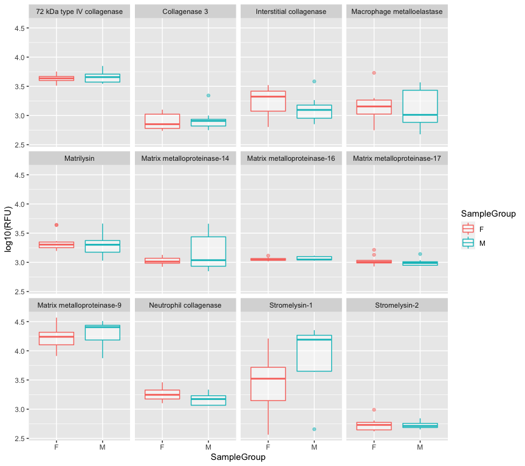

<!-- README.md is generated from README.Rmd. Please edit that file -->

# The R `SomaDataIO` Package from SomaLogic, Inc.

<!-- badges: start -->


[](https://choosealicense.com/licenses/mit/)
<!-- badges: end -->

-----

## Overview

This document accompanies the R package `SomaDataIO`, which loads the
SomaLogic, Inc. proprietary data file called an `*.adat`. The package
provides auxiliary functions for extracting relevant information from
the ADAT object once in the R environment. Basic familiarity with the R
environment is assumed, as is the ability to install contributed
packages from the Comprehensive R Archive Network (CRAN).

-----

## Installation

1.  Download the file `SomaDataIO_0.0.1.tar.gz`.

2.  Ensure that the following package dependencies are pre-installed;
    from the `R >= 3.6.0`
    console:
    
    ``` r
    install.packages(c("magrittr", "devtools", "readr", "purrr", "usethis", "tidyr",
                       "dplyr", "tibble", "cli", "crayon", "stringr"))
    ```

3.  Install via one of these methods:
    
    1.  From the R
        console:
        
        ``` r
        install.packages("SomaDataIO_0.0.1.tar.gz", repos = NULL, type = "source")
        ```
    
    2.  From a command-line terminal (Linux/Mac):
        
        ``` bash
        R --vanilla CMD INSTALL SomaDataIO_0.0.1.tar.gz
        ```

4.  **NOTE:** The `Biobase` package is *suggested*, being required by
    only one function. `Biobase` must be installed separately from
    `Bioconductor` by entering the following from the `R` console:
    
    ``` r
    if (!requireNamespace("BiocManager", quietly = TRUE)) {
      install.packages("BiocManager")
    }
    BiocManager::install("Biobase")
    ```
    
    Information about Bioconductor can be found here:
    <https://bioconductor.org/install/>

5.  Upon *successful* installation:
    
    1.  To load the package:
        
        ``` r
        library(SomaDataIO)
        ```
    
    2.  For an index of available commands:
        
        ``` r
        library(help = SomaDataIO)
        ```

-----

## Main Features

  - Loading data (Import)
      - Import a text file in the `*.adat` format into an `R` session as
        a `soma_adat` object.
  - Manipulating data
      - Subset, reorder, and list various fields of a `soma_adat`
        object.
  - Exporting data (Output)
      - Write out a `soma_adat` object as a `*.adat` text file.

-----

## Load an ADAT

``` r
# Sample file name
f <- system.file("sample", "sample.adat",
                 package = "SomaDataIO", mustWork = TRUE)
my_adat <- read_adat(f)
is.soma_adat(my_adat)
#> [1] TRUE

# S3 print method -> tibble
my_adat
#> ── Attributes ─────────────────────────────────────────────────────────────────────────────────────
#>      Intact               ✓
#> ── Dimensions ─────────────────────────────────────────────────────────────────────────────────────
#>      Rows                 20
#>      Columns              1144
#>      Clinical Data        15
#>      Features             1129
#> ── Column Meta ────────────────────────────────────────────────────────────────────────────────────
#>       SeqId    |   TargetFullName   |   EntrezGeneSymbol   |   Type           |   ColCheck 
#>       SomaId   |   UniProt          |   Organism           |   CalReference   |   Cal.Set.A
#>       Target   |   EntrezGeneID     |   Units              |   Dilution       |   Dilution2
#> ── Tibble ─────────────────────────────────────────────────────────────────────────────────────────
#> # A tibble: 20 x 1,145
#>    row_names PlateId SlideId Subarray SampleId SampleType SampleMatrix TimePoint
#>    <chr>     <chr>     <dbl>    <dbl> <chr>    <chr>      <chr>        <chr>    
#>  1 25385641… Set A   2.54e11        2 01       Sample     Plasma       Young    
#>  2 25385641… Set A   2.54e11        8 02       Sample     Plasma       Young    
#>  3 25385641… Set A   2.54e11        3 03       Sample     Plasma       Young    
#>  4 25385641… Set A   2.54e11        5 04       Sample     Plasma       Young    
#>  5 25385641… Set A   2.54e11        1 05       Sample     Plasma       Young    
#>  6 25385641… Set A   2.54e11        2 06       Sample     Plasma       Old      
#>  7 25385641… Set A   2.54e11        4 07       Sample     Plasma       Young    
#>  8 25385641… Set A   2.54e11        8 08       Sample     Plasma       Young    
#>  9 25385641… Set A   2.54e11        3 09       Sample     Plasma       Old      
#> 10 25385641… Set A   2.54e11        7 10       Sample     Plasma       Old      
#> 11 25385641… Set A   2.54e11        3 11       Sample     Plasma       Old      
#> 12 25385641… Set A   2.54e11        2 12       Sample     Plasma       Young    
#> 13 25385641… Set A   2.54e11        3 13       Sample     Plasma       Old      
#> 14 25385641… Set A   2.54e11        2 14       Sample     Plasma       Old      
#> 15 25385641… Set A   2.54e11        5 15       Sample     Plasma       Young    
#> 16 25385641… Set A   2.54e11        7 16       Sample     Plasma       Old      
#> 17 25385641… Set A   2.54e11        2 17       Sample     Plasma       Young    
#> 18 25385641… Set A   2.54e11        7 18       Sample     Plasma       Old      
#> 19 25385641… Set A   2.54e11        8 19       Sample     Plasma       Old      
#> 20 25385641… Set A   2.54e11        4 20       Sample     Plasma       Old      
#> # … with 1,137 more variables: SampleGroup <chr>, SiteId <chr>,
#> #   Subject_ID <chr>, HybControlNormScale <dbl>, RowCheck <chr>,
#> #   NormScale_40 <dbl>, NormScale_0_005 <dbl>, NormScale_1 <dbl>,
#> #   seq.2182.54 <dbl>, seq.2190.55 <dbl>, seq.2192.63 <dbl>, seq.2201.17 <dbl>,
#> #   seq.2211.9 <dbl>, seq.2212.69 <dbl>, seq.2247.20 <dbl>, seq.2278.61 <dbl>,
#> #   seq.2333.72 <dbl>, seq.2358.19 <dbl>, seq.2381.52 <dbl>, seq.2418.55 <dbl>,
#> #   seq.2421.7 <dbl>, seq.2424.69 <dbl>, seq.2429.27 <dbl>, seq.2431.17 <dbl>,
#> #   seq.2436.49 <dbl>, seq.2441.2 <dbl>, seq.2443.10 <dbl>, seq.2447.7 <dbl>,
#> #   seq.2449.1 <dbl>, seq.2455.17 <dbl>, seq.2468.62 <dbl>, seq.2474.54 <dbl>,
#> #   seq.2475.1 <dbl>, seq.2480.58 <dbl>, seq.2484.49 <dbl>, seq.2500.2 <dbl>,
#> #   seq.2501.51 <dbl>, seq.2505.49 <dbl>, seq.2514.65 <dbl>, seq.2515.14 <dbl>,
#> #   seq.2516.57 <dbl>, seq.2523.31 <dbl>, seq.2524.56 <dbl>, seq.2526.53 <dbl>,
#> #   seq.2558.51 <dbl>, seq.2567.5 <dbl>, seq.2570.72 <dbl>, seq.2571.12 <dbl>,
#> #   seq.2575.5 <dbl>, seq.2578.67 <dbl>, seq.2579.17 <dbl>, seq.2580.83 <dbl>,
#> #   seq.2585.2 <dbl>, seq.2590.69 <dbl>, seq.2597.8 <dbl>, seq.2598.9 <dbl>,
#> #   seq.2599.51 <dbl>, seq.2602.2 <dbl>, seq.2603.61 <dbl>, seq.2605.49 <dbl>,
#> #   seq.2607.54 <dbl>, seq.2609.59 <dbl>, seq.2611.72 <dbl>, seq.2612.5 <dbl>,
#> #   seq.2614.28 <dbl>, seq.2615.60 <dbl>, seq.2616.23 <dbl>, seq.2617.56 <dbl>,
#> #   seq.2618.10 <dbl>, seq.2619.72 <dbl>, seq.2620.4 <dbl>, seq.2622.18 <dbl>,
#> #   seq.2623.54 <dbl>, seq.2624.31 <dbl>, seq.2625.53 <dbl>, seq.2630.12 <dbl>,
#> #   seq.2631.50 <dbl>, seq.2632.5 <dbl>, seq.2633.52 <dbl>, seq.2634.2 <dbl>,
#> #   seq.2635.61 <dbl>, seq.2636.10 <dbl>, seq.2637.77 <dbl>, seq.2638.12 <dbl>,
#> #   seq.2640.3 <dbl>, seq.2642.4 <dbl>, seq.2643.57 <dbl>, seq.2644.11 <dbl>,
#> #   seq.2645.54 <dbl>, seq.2647.66 <dbl>, seq.2649.77 <dbl>, seq.2652.15 <dbl>,
#> #   seq.2653.62 <dbl>, seq.2654.19 <dbl>, seq.2658.27 <dbl>, seq.2665.26 <dbl>,
#> #   seq.2666.53 <dbl>, seq.2668.70 <dbl>, seq.2670.67 <dbl>, seq.2672.60 <dbl>,
#> #   …
#> ═══════════════════════════════════════════════════════════════════════════════════════════════════

print(my_adat, show_header = TRUE)  # if simply wish to see Header info, no features
#> ── Attributes ─────────────────────────────────────────────────────────────────────────────────────
#>      Intact               ✓
#> ── Dimensions ─────────────────────────────────────────────────────────────────────────────────────
#>      Rows                 20
#>      Columns              1144
#>      Clinical Data        15
#>      Features             1129
#> ── Column Meta ────────────────────────────────────────────────────────────────────────────────────
#>       SeqId    |   TargetFullName   |   EntrezGeneSymbol   |   Type           |   ColCheck 
#>       SomaId   |   UniProt          |   Organism           |   CalReference   |   Cal.Set.A
#>       Target   |   EntrezGeneID     |   Units              |   Dilution       |   Dilution2
#> ── Header Data ────────────────────────────────────────────────────────────────────────────────────
#>      Version                  >     1.2     
#>      AssayType                >     PharmaServices     
#>      AssayRobot               >     Beckman BioMek Fx     
#>      AssayVersion             >     v3.0     
#>      CreatedBy                >     User: sfield; Package: SomaReadr_4.0.0; using R version 3.6.2 (2020-01-01); Platform: x86_64, darwin15.6.0     
#>      CreatedDate              >     2020-02-24     
#>      DerivedFrom              >     C:/SomaSciences/2012/PX-00-000_SampleAdat/ADat/SL-01-999.adat     
#>      EnteredBy                >     SGF     
#>      ExpDate                  >     2014-10-02     
#>      GeneratedBy              >     Px (Build: 519 : de0e5106fd61f1630991374486291961dd97c243)     
#>      MasterMixVersion         >     V3     
#>      PlateMedianCal_Set_A     >     1.00     
#>      ProcessSteps             >     Raw RFU; HybNorm External file; MedNorm([SampleType]); Calibrate from External file; ADatScrubber Premium;     
#>      ProteinEffectiveDate     >     2014-10-21     
#>      ReportType               >     Prepared for Release     
#>      StudyMatrix              >     EDTA Plasma     
#>      StudyOrganism            >     Human     
#>      Title                    >     SL-01-999     
#> ═══════════════════════════════════════════════════════════════════════════════════════════════════
```

## Attributes contain feature information

``` r
attributes(my_adat)$Col.Meta
#> # A tibble: 1,129 x 15
#>    SeqId SomaId Target TargetFullName UniProt EntrezGeneID EntrezGeneSymbol
#>    <chr> <chr>  <chr>  <chr>          <chr>   <chr>        <chr>           
#>  1 2182… SL000… C4b    Complement C4b P0C0L4… 720 721      C4A C4B         
#>  2 2190… SL002… Coagu… Coagulation F… P03951  2160         F11             
#>  3 2192… SL003… CTACK  C-C motif che… Q9Y4X3  10850        CCL27           
#>  4 2201… SL000… Endos… Endostatin     P39060  80781        COL18A1         
#>  5 2211… SL000… TIMP-1 Metalloprotei… P01033  7076         TIMP1           
#>  6 2212… SL000… tPA    Tissue-type p… P00750  5327         PLAT            
#>  7 2247… SL004… EG-VE… Prokineticin-1 P58294  84432        PROK1           
#>  8 2278… SL000… TIMP-2 Metalloprotei… P16035  7077         TIMP2           
#>  9 2333… SL000… TGF-b1 Transforming … P01137  7040         TGFB1           
#> 10 2358… SL003… VEGF … Vascular endo… P35916  2324         FLT4            
#> # … with 1,119 more rows, and 8 more variables: Organism <chr>, Units <chr>,
#> #   Type <chr>, CalReference <dbl>, Dilution <chr>, ColCheck <chr>,
#> #   Cal.Set.A <dbl>, Dilution2 <dbl>
```

## Manipulate a `soma_adat` Object

``` r
getFeatures(my_adat) %>% head(20)     # first 20 features
#>  [1] "seq.2182.54" "seq.2190.55" "seq.2192.63" "seq.2201.17" "seq.2211.9" 
#>  [6] "seq.2212.69" "seq.2247.20" "seq.2278.61" "seq.2333.72" "seq.2358.19"
#> [11] "seq.2381.52" "seq.2418.55" "seq.2421.7"  "seq.2424.69" "seq.2429.27"
#> [16] "seq.2431.17" "seq.2436.49" "seq.2441.2"  "seq.2443.10" "seq.2447.7"
getFeatures(my_adat) %>% length()     # how many features
#> [1] 1129
getFeatures(my_adat, n = TRUE)        # the `n` argument; no. features
#> [1] 1129
```

## Write out a `soma_adat`

``` r
is.intact.attributes(my_adat)         # attributes MUST be intact to write
#> [1] TRUE

fout <- tempfile(fileext = ".adat")   # random file name
write_adat(my_adat, file = fout)
#> ✓ ADAT passed checks and traps
#> ✓ ADAT written to: '/var/folders/rh/hw387cn94f9431b9pdqjx1ss223hd0/T/RtmpcDvJas/filed6f318e3bcf8.adat'
```

-----

# A Typical Analysis

## Load data

``` r
data <- read_adat(f)
dim(data)
#> [1]   20 1144

train <- dplyr::filter(data, TimePoint == "Young")
table(train$SampleGroup)    # M vs F
#> 
#> F M 
#> 5 5
```

## Subset Features starting with `MMP`

``` r
mmps <- my_adat %>% 
  getFeatureData() %>% 
  filter(grepl("^MMP", Target))

# feature data info
mmps  
#> # A tibble: 12 x 16
#>    AptName SeqId SomaId Target TargetFullName UniProt EntrezGeneID
#>    <chr>   <chr> <chr>  <chr>  <chr>          <chr>   <chr>       
#>  1 seq.25… 2579… SL000… MMP-9  Matrix metall… P14780  4318        
#>  2 seq.27… 2788… SL000… MMP-3  Stromelysin-1  P08254  4314        
#>  3 seq.27… 2789… SL000… MMP-7  Matrilysin     P09237  4316        
#>  4 seq.28… 2838… SL003… MMP-17 Matrix metall… Q9ULZ9  4326        
#>  5 seq.29… 2954… SL000… MMP-8  Neutrophil co… P22894  4317        
#>  6 seq.37… 3743… SL000… MMP-10 Stromelysin-2  P09238  4319        
#>  7 seq.41… 4160… SL000… MMP-2  72 kDa type I… P08253  4313        
#>  8 seq.44… 4496… SL000… MMP-12 Macrophage me… P39900  4321        
#>  9 seq.49… 4924… SL000… MMP-1  Interstitial … P03956  4312        
#> 10 seq.49… 4925… SL000… MMP-13 Collagenase 3  P45452  4322        
#> 11 seq.50… 5002… SL002… MMP-14 Matrix metall… P50281  4323        
#> 12 seq.52… 5268… SL003… MMP-16 Matrix metall… P51512  4325        
#> # … with 9 more variables: EntrezGeneSymbol <chr>, Organism <chr>, Units <chr>,
#> #   Type <chr>, CalReference <dbl>, Dilution <chr>, ColCheck <chr>,
#> #   Cal.Set.A <dbl>, Dilution2 <dbl>
```

## Generate list of `t-tests`

``` r
t_tests <- mmps$AptName %>% 
  purrr::set_names(., .) %>% 
  purrr::map(~ {
    sprintf("%s ~ SampleGroup", .x) %>% 
      as.formula() %>% 
      t.test(data = data)
  })
```

## Re-order by `p-value`

``` r
idx <- t_tests %>% 
  purrr::map("p.value") %>% 
  stringr::str_order()
idx
#>  [1]  2  5 11 12  9  4  1  7 10  3  6  8

t_tests %<>% magrittr::extract(idx)
t_tests %>% head() %>% purrr::map("p.value")
#> $seq.2788.55
#> [1] 0.02987761
#> 
#> $seq.2954.56
#> [1] 0.1041228
#> 
#> $seq.5002.76
#> [1] 0.1748572
#> 
#> $seq.5268.49
#> [1] 0.2894841
#> 
#> $seq.4924.32
#> [1] 0.3016575
#> 
#> $seq.2838.53
#> [1] 0.3718348
```

## Visualize with `ggplot2()`

``` r
targets <- as.list(mmps$AptName) %>%
  purrr::set_names(mmps$TargetFullName)   # create SeqId -> target map
df <- data %>% 
  dplyr::select(SampleGroup, all_of(mmps$AptName)) %>% 
  dplyr::rename(!!! targets) %>% 
  tidyr::pivot_longer(-SampleGroup, names_to = "Feature", values_to = "RFU") %>% 
  tibble::as_tibble()
df
#> # A tibble: 240 x 3
#>    SampleGroup Feature                        RFU
#>    <chr>       <chr>                        <dbl>
#>  1 M           Matrix metalloproteinase-9  27323.
#>  2 M           Stromelysin-1                 454.
#>  3 M           Matrilysin                   1494.
#>  4 M           Matrix metalloproteinase-17  1016.
#>  5 M           Neutrophil collagenase       2013.
#>  6 M           Stromelysin-2                 488.
#>  7 M           72 kDa type IV collagenase   3491.
#>  8 M           Macrophage metalloelastase    547.
#>  9 M           Interstitial collagenase     1507.
#> 10 M           Collagenase 3                2203.
#> # … with 230 more rows

df %>% 
  ggplot(aes(x = SampleGroup, y = log10(RFU), colour = SampleGroup)) +
  geom_boxplot(alpha = 0.5) +
  facet_wrap(~Feature)
```

<!-- -->

-----

## MIT LICENSE

  - See [LICENSE](LICENSE.md)
  - The MIT
        License:
      - <https://choosealicense.com/licenses/mit/>
      - [https://tldrlegal.com/license/mit-license/](https://tldrlegal.com/license/mit-license)

-----

Created by [Rmarkdown](https://github.com/rstudio/rmarkdown) (v2.1) and
R version 3.6.3 (2020-02-29).
