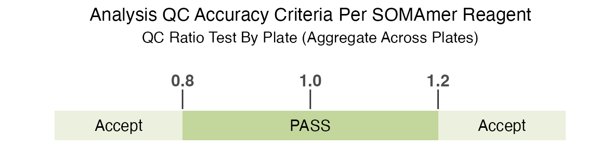
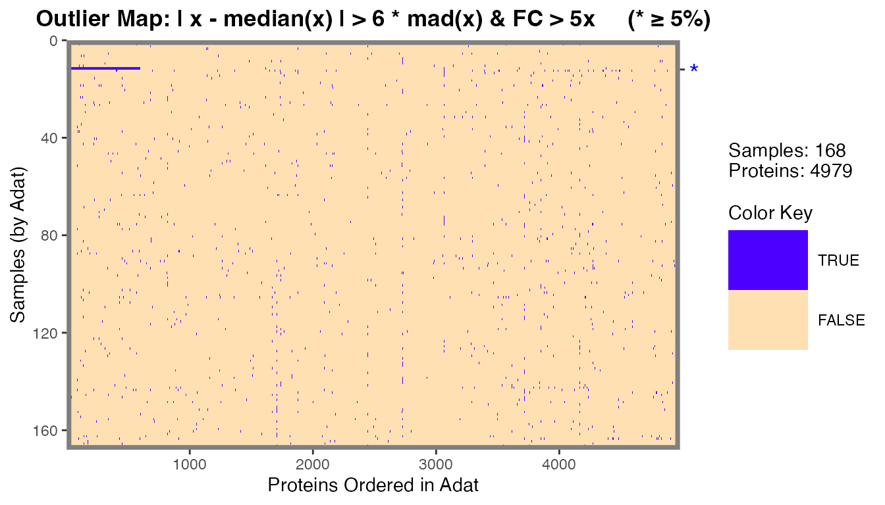
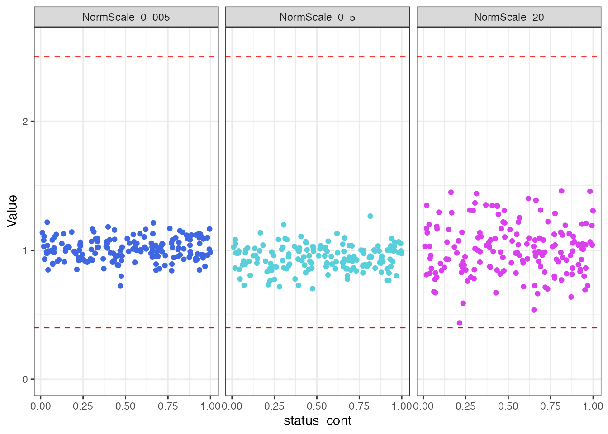
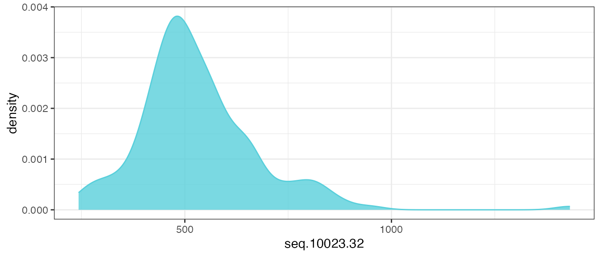
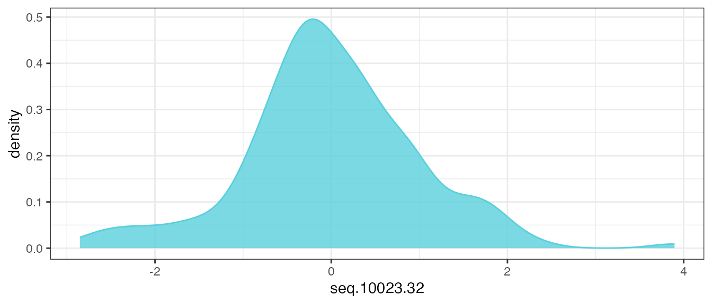
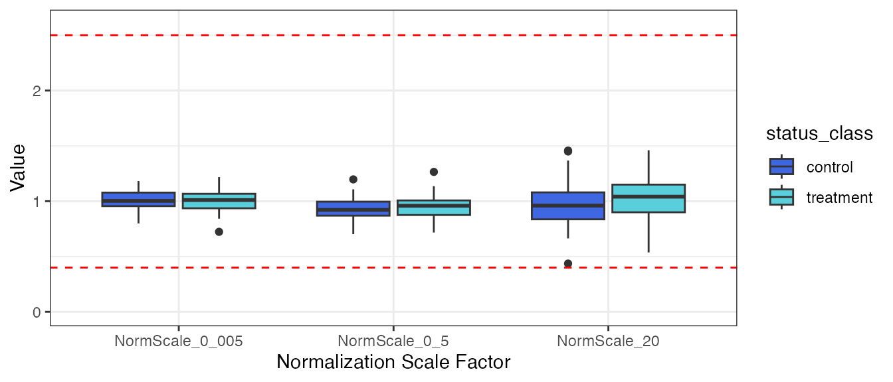
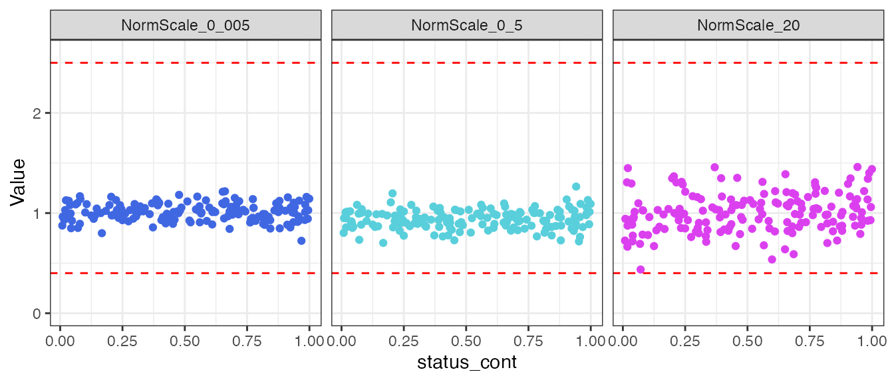

# Pre-Processing SomaScan

## Overview

`SomaDataIO` contains functionality to prepare a SomaScan .adat data
file containing microarray-based relative fluorescent units (RFUs) for
analysis. The typical data analysis path includes several steps of
pre-processing, including:

1.  Filtering features
2.  Filtering samples
3.  Data QC
4.  Transformations

This article will walk through *why* these pre-processing steps are
recommended prior to executing an analysis on SomaScan data, along with
*how* these steps can be performed using the `SomaDataIO` package.

------------------------------------------------------------------------

### Load Libraries

``` r
library(SomaDataIO)
library(ggplot2)
library(dplyr)
library(purrr)
```

### Filtering Features

The goal of this pre-processing step is to remove features (SeqIds)
typically not useful for analysis from a SomaScan dataset, while also
retaining *relevant* features that will enable broad discovery during
downstream analysis.

The filtering logic typically used for protein features (i.e. SOMAmer
Reagents) is:

    Type == "Protein" & Organism == "Human"

What information does this logic convey? It indicates that only **human
protein** features from the raw SomaScan data set should be retained.
This can be accomplished by filtering on the ADAT `Type` attribute,
which represents the SOMAmer target type. This will be used in
conjunction with the `Organism` attribute, which represents the organism
from which the protein originated.

These two attributes (`Type` and `Organism`) can be accessed via
[`SomaDataIO::getAnalyteInfo()`](https://somalogic.github.io/SomaDataIO/reference/getAnalyteInfo.md).
This function retrieves the analyte annotation data (i.e. the column
metadata, or `COL_DATA`) that appears above the protein measurements in
the ADAT file, and returns it in a `data.frame` format.

*Note: The `example_data` object used in this vignette is a V4.0 plasma
ADAT. Other matrices or versions of ADATs may contain expanded feature
sets. For more information about the format and content of an ADAT,
please* *reference the*
[SomaLogic-Data](https://github.com/SomaLogic/SomaLogic-Data) *GitHub
repository.*

To retrieve the column metadata annotations for the data set:

``` r
annots <- getAnalyteInfo(example_data)
```

We can now check the contents of the `Type` and `Organism` attributes,
which can be accessed as columns of a data frame once extracted with
[`getAnalyteInfo()`](https://somalogic.github.io/SomaDataIO/reference/getAnalyteInfo.md):

``` r
annots |> count(Type) |> arrange(desc(n))
#> # A tibble: 7 × 2
#>   Type                              n
#>   <chr>                         <int>
#> 1 Protein                        5207
#> 2 Non-Human                        24
#> 3 Spuriomer                        20
#> 4 Hybridization Control Elution    12
#> 5 Non-Biotin                       10
#> 6 Deprecated                        7
#> 7 Non-cleavable                     4

annots |> count(Organism) |> arrange(desc(n))
#> # A tibble: 14 × 2
#>    Organism                                                           n
#>    <chr>                                                          <int>
#>  1 Human                                                           5032
#>  2 Mouse                                                            228
#>  3 Aequorea victoria (Jellyfish)                                      3
#>  4 African clawed frog                                                3
#>  5 Heloderma suspectum (Gila monster)                                 3
#>  6 Hornet                                                             3
#>  7 Thermus thermophilus                                               3
#>  8 Photinus pyralis (North American firefly)                          2
#>  9 Sambucus nigra (European elder)                                    2
#> 10 Cyanidium caldarium                                                1
#> 11 Geobacillus stearothermophilus (Bacillus stearothermophilus)       1
#> 12 Rhizobium meliloti (Ensifer meliloti) (Sinorhizobium meliloti)     1
#> 13 isolate BEN                                                        1
#> 14 isolate LW123                                                      1
```

As described in the filtering strategy above, we only want to retain the
features for which `Type == "Protein"`, indicating that the feature is
related to a human protein. In the same filtering step, we can also
specify that we only want to retain proteins found in humans
(`Organism == "Human")`. In some versions of the assay there are SeqIds
labeled “Internal Use Only” which are not intended for downstream
analysis and can also be removed. This can be performed using
[`dplyr::filter()`](https://dplyr.tidyverse.org/reference/filter.html):

``` r
human_prots <- getAnalyteInfo(example_data) |>
  filter(Type == "Protein" & Organism == "Human") |>
  filter(!grepl("^Internal Use Only", TargetFullName))
length(human_prots$SeqId)
#> [1] 4979
```

The original dataset (`example_adat`) contained 5284 analytes; after
filtering for human proteins and removing 305 features as described
above, it contains 4979 analytes.

Remember that the `human_prots` object is not an ADAT, but rather a
`data.frame` representing the column metadata that corresponds to the
`example_data` ADAT object. We must now filter the `example_data` object
to match the filtering performed on the `human_prots` object.

``` r
# Identify SeqIds that differ between the data sets
discard <- setdiff(grep("^seq\\.", colnames(example_data), value = TRUE), 
                   human_prots$AptName)
# Discard non-human, non-protein features
filt_data <- example_data |>
  dplyr::select(-all_of(discard))
```

This data set now contains only human proteins.

#### Flagged Features

Our human protein analyte annotations object `human_prots` contains a
single column, called `ColCheck`, that can be used for filtering flagged
features from ADAT datasets. This column contains the QC acceptance
criteria for all plates/sets. The standard QC acceptance criteria used
to determine if a feature is flagged is if the QC ratio by plate
(aggregate across all plates) is within the acceptance range of 0.8 to
1.2:



Again, please see
[SomaLogic-Data](https://github.com/SomaLogic/SomaLogic-Data) for more
details.

``` r
human_prots |> count(ColCheck)
#> # A tibble: 2 × 2
#>   ColCheck     n
#>   <chr>    <int>
#> 1 FLAG       214
#> 2 PASS      4765
```

214 human protein features in `filt_data` were flagged in this column
check, and are marked with a `FLAG` value. The presence of a `FLAG`
value indicates the SeqId for one of the QC control samples was outside
the range shown above on at least one plate. The total number of SeqIds
outside this range can be used to assess potential issues with runs or
studies, however a `FLAG` value does not necessarily indicate a problem
with the signal for a specific analyte in the study samples. Therefore,
these features **should not** be filtered out of the dataset as part of
standard pre-processing.

------------------------------------------------------------------------

### Filtering Samples

The next pre-processing step to consider is filtering samples. A typical
data analysis is focused on only the study samples within the ADAT file.
The `SampleType` column in the `filt_data` object can be used to filter
down to the study samples only.

``` r
filt_data |> count(SampleType)
#> # A tibble: 4 × 2
#>   SampleType     n
#>   <chr>      <int>
#> 1 Buffer         6
#> 2 Calibrator    10
#> 3 QC             6
#> 4 Sample       170
```

An ADAT file will also include buffer, calibrator and QC samples. It is
recommended to remove these samples prior to an analysis.

``` r
filt_data <- filt_data |> 
  filter(SampleType == "Sample")
```

The `filt_data` object now has 170 study samples, after removing the 10
calibrator samples (replicate controls for combining data across runs),
6 QC samples (replicate controls used to assess run quality), and 6
buffer samples (no protein controls).

#### Flagged Samples

An ADAT file contains a single column, called `RowCheck`, that can be
used for filtering out flagged samples that do not pass a pre-defined
normalization acceptance criteria.

The standard normalization acceptance criteria used to determine if a
sample is flagged by the `RowCheck` column is if *any* of the *rowwise*
normalization scale factors are outside of the acceptance range of 0.4
to 2.5:


``` r
filt_data |>
  count(RowCheck) |> 
  mutate(percent = n / sum(n) * 100)
#> # A tibble: 2 × 3
#>   RowCheck     n percent
#>   <chr>    <int>   <dbl>
#> 1 FLAG         2    1.18
#> 2 PASS       168   98.8
```

Note 2 samples in `filt_data` are flagged with this row check, and are
marked with a `FLAG` value.

``` r
# pull normalization scale factor variable names from ADAT
norm_vars <- grep("^[Nn]orm[Ss]cale|^Med\\.Scale\\.", 
                  names(filt_data), value = TRUE)

filt_data |>
  filter(!RowCheck == "PASS") |> 
  dplyr::select(SampleId, all_of(norm_vars)) |> 
  as.data.frame()
#>                SampleId NormScale_20 NormScale_0_005 NormScale_0_5
#> 258495800110_3      126    0.3700948        1.064435     0.9836240
#> 258495800109_1      147    0.2891420        1.111629     0.9634776
```

We can see that these samples each have a normalization scale factor
from at least one dilution bin that fall below the standard accepted
range. Filtering samples based on the default `RowCheck` column will
drop these samples from `filt_data`.

``` r
filt_data <- filt_data |> 
  filter(RowCheck == "PASS")
```

Note that normalization to a reference may result in scaling bias in
certain scenarios. It is recommended to check the flag rate using the
default acceptance criteria from `RowCheck`, and if \> 10% of samples
are flagged, further evaluation may be needed.

Depending on your data and experiment, it may be reasonable to keep
samples with `FLAG` values, particularly those samples close to the
acceptance criteria boundary. The `FLAG` value indicates non-conformance
to a reference (either study-specific or external such as ANML), and
further evaluation is encouraged to assess if those samples should be
considered true outliers for a given study and removed.

#### Sample Level Outliers by RFU

It is also important to evaluate if there are any sample-level outliers
by RFU measurements. For standard plasma and serum studies Standard
BioTools’ recommended outlier definition is any sample where `>= 5%` of
RFU measurements exceed 6 median absolute deviations (MADs) and 5x
fold-change from median signal.

This filter is typically appropriate for studies on plasma, serum, and
other biological matrices generally exhibiting homeostatic
characteristics. For studies on matrices such as tissue homogenate, cell
culture, or study designs containing client-provided background lysis
buffer controls (or similar), this filter will likely not be
appropriate.

``` r
# filt_data does not have any outliers by default
# create a "fake" outlier sample as an example
apts <- getAnalytes(filt_data)
filt_data[12, apts[1:600]] <- filt_data[12, apts[1:600]] * 100  # 600 apts ~ 12%
```

We can identify plasma and serum outlier samples using this definition
with the
[`calcOutlierMap()`](https://somalogic.github.io/SomaDataIO/reference/calcOutlierMap.md)
function.

``` r
om <- calcOutlierMap(filt_data)
plot(om)
#> Warning: The `size` argument of `element_rect()` is deprecated as of ggplot2
#> 3.4.0.
#> ℹ Please use the `linewidth` argument instead.
#> ℹ The deprecated feature was likely used in the SomaDataIO package.
#>   Please report the issue at
#>   <https://github.com/SomaLogic/SomaDataIO/issues>.
#> This warning is displayed once per session.
#> Call `lifecycle::last_lifecycle_warnings()` to see where this warning
#> was generated.
```



The one sample in `filt_data` that we modified in the previous code
chunk was identified as an outlier by RFU measurements with the `*`.

The
[`getOutlierIds()`](https://somalogic.github.io/SomaDataIO/reference/getOutlierIds.md)
function is useful for extracting the sample IDs that were flagged as
outliers in the plot. These sample IDs should be investigated further
and possibly considered for removal prior to analysis.

``` r
rfu_outliers <- getOutlierIds(om)
rfu_outliers
#>   idx
#> 1  12

# drop one outlier sample
filt_data <- filt_data |> 
  filter(!dplyr::row_number() %in% rfu_outliers$idx)
```

------------------------------------------------------------------------

### Data QC

The goal of this step is to assess if the normalization applied to the
input ADAT is appropriate for the study. To accomplish this, we can
check the association of normalization scale factors with any *endpoint*
of interest.

As an example, we will create a `status_class` two-group endpoint
variable and a `status_cont` continuous endpoint variable in the
`filt_data` ADAT.

``` r
# create "status" endpoints as examples
filt_data <- withr::with_seed(101,
  filt_data |> 
    mutate(status_cont = runif(nrow(filt_data))) |> 
    mutate(status_class = ifelse(status_cont > 0.5, "treatment", "control"))
)
```

Plot the normalization scale factors by the `status_class` endpoint.

``` r
filt_data |> 
  select(SampleId, status_class, all_of(norm_vars)) |> 
  tidyr::pivot_longer(!c(SampleId, status_class),
                      names_to = "Normalization Scale Factor",
                      values_to = "Value") |> 
  ggplot(aes(x = `Normalization Scale Factor`, y = Value, fill = status_class)) +
    geom_boxplot() +
    ylim(0, 2.6) +
    geom_hline(yintercept  = 0.4, linetype = "dashed", color = "red") +
    geom_hline(yintercept  = 2.5, linetype = "dashed", color = "red") +
    theme_bw() +
    scale_fill_manual(values = c("#4067E2", "#59CFDB"))
```


There does not appear to be any visual normalization bias by
`status_class`. This conclusion is confirmed by the results from
t-tests.

``` r
norm_vars |>
  as_tibble() |> 
  mutate(
    formula = map(norm_vars, ~ as.formula(paste(.x, "~ status_class"))), # create formula
    t_test  = map(formula, ~ stats::t.test(.x, data = filt_data)),  # fit t-tests
    t_stat  = map_dbl(t_test, "statistic"),            # pull out t-statistic
    p.value = map_dbl(t_test, "p.value"),              # pull out p-values
    fdr     = p.adjust(p.value, method = "BH")         # FDR for multiple testing
  ) 
#> # A tibble: 3 × 6
#>   value           formula   t_test  t_stat p.value   fdr
#>   <chr>           <list>    <list>   <dbl>   <dbl> <dbl>
#> 1 NormScale_20    <formula> <htest>  0.604   0.547 0.585
#> 2 NormScale_0_005 <formula> <htest> -1.58    0.117 0.351
#> 3 NormScale_0_5   <formula> <htest> -0.548   0.585 0.585
```

Now, check for normalization bias by the continuous endpoint
`status_cont`.

``` r
filt_data |> 
  select(SampleId, status_cont, all_of(norm_vars)) |> 
  tidyr::pivot_longer(!c(SampleId, status_cont),
                      names_to = "Normalization Scale Factor",
                      values_to = "Value") |> 
  ggplot(aes(x = status_cont, y = Value, color = `Normalization Scale Factor`)) +
    geom_point() +
    ylim(0, 2.6) +
    geom_hline(yintercept  = 0.4, linetype = "dashed", color = "red") +
    geom_hline(yintercept  = 2.5, linetype = "dashed", color = "red") +
    theme_bw() +
    scale_color_manual(values = c("#4067E2", "#59CFDB", "#DB40EF")) +
    facet_wrap(~`Normalization Scale Factor`) +
    theme(legend.position = "none")
```



There does not appear to be any visual normalization bias by the
`status_cont` continuous endpoint. This conclusion is confirmed by the
results from correlation tests.

``` r
norm_vars |>
  as_tibble() |> 
  mutate(
    formula = map(norm_vars, ~ as.formula(paste("~ status_cont +", .x))), # create formula
    cor     = map(formula, ~ stats::cor.test(.x, data = filt_data)),  # calculate correlations
    pearson = map_dbl(cor, "statistic"),            # pull out test statistic
    p.value = map_dbl(cor, "p.value"),              # pull out p-values
    fdr     = p.adjust(p.value, method = "BH")      # FDR for multiple testing
  ) 
#> # A tibble: 3 × 6
#>   value           formula   cor     pearson p.value   fdr
#>   <chr>           <list>    <list>    <dbl>   <dbl> <dbl>
#> 1 NormScale_20    <formula> <htest>   0.132   0.895 0.895
#> 2 NormScale_0_005 <formula> <htest>   0.674   0.501 0.853
#> 3 NormScale_0_5   <formula> <htest>   0.571   0.569 0.853
```

If there *is* a considerable normalization bias observed in your ADAT,
an alternate normalization should be used for univariate analyses, and
any planned analyses may need to be modified to account for this bias.

------------------------------------------------------------------------

### Transformations

SomaScan data is typically delivered to end users as normalized,
untransformed RFUs. Many analytic operations are best performed using
these untransformed values, including fold-change calculations,
[bridging RFUs across assay
versions](https://somalogic.github.io/SomaDataIO/articles/lifting-and-bridging.html),
calculating coefficients of variation (CV) for replicate samples, and
comparing study-specific RFUs to population reference values provided in
the [SomaScan Menu Tool](https://somalogic.com/somascan-menu/).

While many operations are conducted on untransformed RFU values, it is
important to note that for each SeqId, the distribution of biological
sample RFUs generally follows a right-tailed, log-normal distribution.
Let’s take a look at the distribution of one example analyte feature,
`seq.10023.32`, before any transformations are applied.

``` r
filt_data |> 
  ggplot(aes(x = seq.10023.32)) +
  geom_density(fill = "#59CFDB", color = "#59CFDB", alpha = 0.8) +
  theme_bw()
```



There is a log-normal distribution, with a long right-tail in the
distribution of raw RFU values, and this is the assumed distribution of
untransformed analytes provided in an ADAT file.

#### Log-10

Performing a log10 transformation is recommended prior to using methods
that assume normally distributed measurements. Please note that
real-world data rarely conforms exactly to ideal distributional
assumptions and analysts should feel free to explore alternative
transformations that may better suit their specific data and statistical
test assumptions. However, we have found that the log10 transformation
is broadly appropriate for standard parametric analyses across the
SomaScan menu.

The `SomaDataIO` package provides a
[`log10()`](https://rdrr.io/r/base/Log.html) math generic function for
the `soma_adat` class, which will log-10 transform all SOMAmer analyte
features within an ADAT file.

``` r
filt_data <- filt_data |> 
  log10() 
```

#### Centering and Scaling (Z-Score)

A further transformation to consider applying to the analyte features is
a Z-score transformation if your experiment includes any multivariate
analysis. To compare relative differential signal across analyte
features, centering and scaling all of the RFU values should be applied
through a Z-score transformation:

$$Z = \frac{x - \mu}{\sigma}$$

where $x$ is the observed value, $\mu$, is the mean of the sample, and
$\sigma$ is the standard deviation of the sample. The z-score
transformation is typically performed on log10-transformed RFUs.

This can be done by creating a simple function, `center_scale()`, and
applying it to all analytes in `filt_data`.

``` r
# center/scale
center_scale <- function(.x) {    # .x = numeric vector
  out <- .x - mean(.x)  # center
  out / sd(out)         # scale
}

filt_data <- filt_data |> 
  mutate(across(getAnalytes(filt_data), center_scale))
```

Now, re-examine the distribution of the same analyte feature
`seq.10023.32`:

``` r
filt_data |> 
  ggplot(aes(x = seq.10023.32)) +
  geom_density(fill = "#59CFDB", color = "#59CFDB", alpha = 0.8) +
  theme_bw()
```



After applying the transformations, the distribution of all of the
pre-processed analyte features should look similar to the above. If true
modal behavior of any analytes are observed, it may require secondary
assessment and further evaluation.

While centering and scaling standardizes the RFU distributions across
all SeqIds for multivariate analysis, it is important to understand that
this does *not* enable meaningful comparison of expression values
between different SeqIds. Take, for instance, hypothetical SeqId A with
a z-score of 2 and hypothetical SeqId B with a z-score of -1. One cannot
infer that the protein target of SeqId A was present at a higher
concentration than the target of SeqId B in the original sample prep.
All comparisons should be made between sample groups *within* a given
SeqId. The RFU value, as well as log10 RFU and z-score, is dependent on
variety of analyte-specific factors such as the SOMAmer Reagent-target
protein binding kinetics, the dilution bin of the SOMAmer reagent,
NHS-biotin conjugation efficiency of the SOMAmer, and other factors
intrinsic to the SOMAmer Reagent within the SomaScan assay.

------------------------------------------------------------------------

### `preProcessAdat()` function

The
[`preProcessAdat()`](https://somalogic.github.io/SomaDataIO/reference/preProcessAdat.md)
function is available to perform the steps outlined in this vignette. By
default, it will filter features and samples using the standard QC and
normalization acceptance criteria described earlier, but *will not* drop
sample-level RFU outliers. It also has the option to perform log-10 and
center & scale transformations to the untransformed RFU values. If data
QC plots by endpoints or clinical variables are desired,the names of the
variables should be explicitly passed to the `data.qc` argument. Please
see the
[`preProcessAdat()`](https://somalogic.github.io/SomaDataIO/reference/preProcessAdat.md)
function documentation for more details.

``` r
# first recreate outlier and endpoints, and add to original example_data object
apts <- getAnalytes(example_data)
example_data[12, apts[1:600]] <- example_data[12, apts[1:600]] * 100  # 600 apts ~ 12%

example_data <- withr::with_seed(101,
  example_data |> 
    mutate(status_cont  = runif(nrow(example_data))) |> 
    mutate(status_class = ifelse(status_cont > 0.5, "treatment", "control"))
)
```

``` r
processed_data <- preProcessAdat(adat            = example_data,
                                 filter.features = TRUE,
                                 filter.controls = TRUE,
                                 filter.rowcheck = TRUE,
                                 filter.outliers = FALSE,
                                 data.qc         = c("status_class",
                                                     "status_cont"),
                                 log.10          = FALSE,
                                 center.scale    = FALSE)
#> ✔ 305 non-human protein features were removed.
#> → 214 human proteins did not pass standard QC
#> acceptance criteria and were flagged in `ColCheck`.
#> ✔ 6 buffer samples were removed.
#> ✔ 10 calibrator samples were removed.
#> ✔ 6 QC samples were removed.
#> ✔ 2 samples flagged in `RowCheck` did not
#> pass standard normalization acceptance criteria (0.4 <= x <= 2.5)
#> and were removed.
#> → Data QC plots were generated:
#> $status_class
```



    #> 
    #> $status_cont



``` r

processed_data
#> ══ SomaScan Data ══════════════════════════════════════════════════════
#>      SomaScan version     V4 (5k)
#>      Signal Space         5k
#>      Attributes intact    ✓
#>      Rows                 168
#>      Columns              5015
#>      Clinical Data        36
#>      Features             4979
#> ── Column Meta ────────────────────────────────────────────────────────
#> ℹ SeqId, SeqIdVersion, SomaId, TargetFullName, Target,
#> ℹ UniProt, EntrezGeneID, EntrezGeneSymbol, Organism, Units,
#> ℹ Type, Dilution, PlateScale_Reference, CalReference,
#> ℹ Cal_Example_Adat_Set001, ColCheck,
#> ℹ CalQcRatio_Example_Adat_Set001_170255, QcReference_170255,
#> ℹ Cal_Example_Adat_Set002,
#> ℹ CalQcRatio_Example_Adat_Set002_170255, Dilution2
#> ── Tibble ─────────────────────────────────────────────────────────────
#> # A tibble: 168 × 5,016
#>    row_names      PlateId  PlateRunDate ScannerID PlatePosition SlideId
#>    <chr>          <chr>    <chr>        <chr>     <chr>           <dbl>
#>  1 258495800012_3 Example… 2020-06-18   SG152144… H9            2.58e11
#>  2 258495800004_7 Example… 2020-06-18   SG152144… H8            2.58e11
#>  3 258495800010_8 Example… 2020-06-18   SG152144… H7            2.58e11
#>  4 258495800003_4 Example… 2020-06-18   SG152144… H6            2.58e11
#>  5 258495800009_4 Example… 2020-06-18   SG152144… H5            2.58e11
#>  6 258495800012_8 Example… 2020-06-18   SG152144… H4            2.58e11
#>  7 258495800001_3 Example… 2020-06-18   SG152144… H3            2.58e11
#>  8 258495800004_8 Example… 2020-06-18   SG152144… H2            2.58e11
#>  9 258495800001_8 Example… 2020-06-18   SG152144… H12           2.58e11
#> 10 258495800009_8 Example… 2020-06-18   SG152144… H10           2.58e11
#> # ℹ 158 more rows
#> # ℹ 5,010 more variables: Subarray <dbl>, SampleId <chr>,
#> #   SampleType <chr>, PercentDilution <int>, SampleMatrix <chr>,
#> #   Barcode <lgl>, Barcode2d <chr>, SampleName <lgl>,
#> #   SampleNotes <lgl>, AliquotingNotes <lgl>, …
#> ═══════════════════════════════════════════════════════════════════════
```

------------------------------------------------------------------------

### Questions

As always, if you have any pre-processing questions, we are here to
help. Please reach out to us via:

- GitHub [SUPPORT](https://somalogic.github.io/SomaDataIO/SUPPORT.html)
- Global Scientific Engagement Team: <techsupport@somalogic.com>
- General SomaScan inquiries: <support@somalogic.com>
