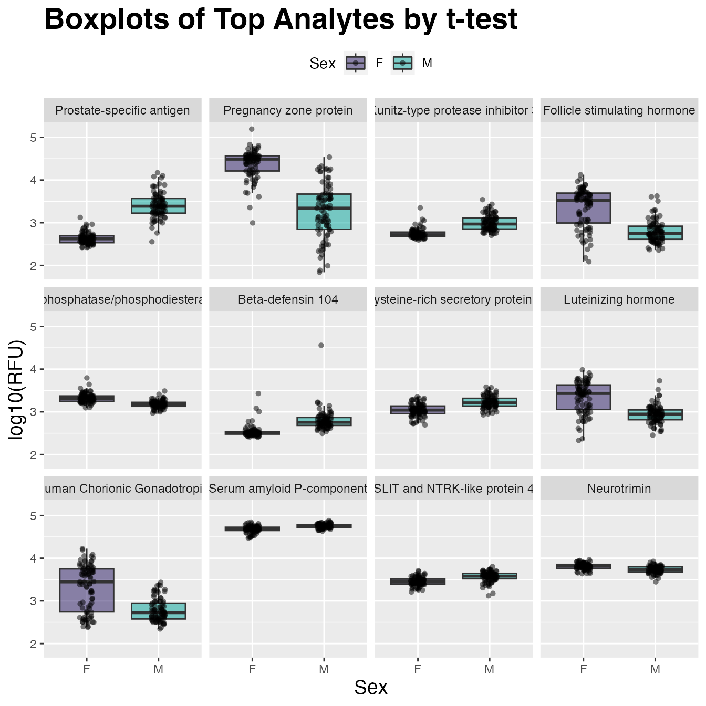

# Two-Group Comparison

------------------------------------------------------------------------

## Differential Expression via *t*-test

Although targeted statistical analyses are beyond the scope of the
`SomaDataIO` package, below is an example analysis that typical
users/customers would perform on ‘SomaScan’ data.

It is not intended to be a definitive guide in statistical analysis and
existing packages do exist in the `R` ecosystem that perform parts or
extensions of these techniques. Many variations of the workflow below
exist, however the framework highlights how one could perform standard
*preliminary* analyses on ‘SomaScan’ data.

## Load Libraries

``` r
library(SomaDataIO)
library(ggplot2)
library(dplyr)
library(tidyr)
library(purrr)
```

## Data Preparation

``` r
# the `example_data` .adat object
# download from `SomaLogic-Data` repo or directly via bash command:
# `wget https://raw.githubusercontent.com/SomaLogic/SomaLogic-Data/main/example_data.adat`
# then read in to R with:
# example_data <- read_adat("example_data.adat")
dim(example_data)
#> [1]  192 5318

table(example_data$SampleType)
#> 
#>     Buffer Calibrator         QC     Sample 
#>          6         10          6        170

# prepare data set for analysis using `preProcessAdat()`
cleanData <- example_data |>
  preProcessAdat(
    filter.features = TRUE,       # remove non-human protein features
    filter.controls = TRUE,       # remove control samples
    filter.rowcheck = TRUE,       # retain only passing samples
    log.10          = TRUE,       # log10 transform
    center.scale    = FALSE       # don't center/scale for univariate analysis
  )
#> ✔ 305 non-human protein features were removed.
#> → 214 human proteins did not pass standard QC
#> acceptance criteria and were flagged in `ColCheck`.
#> ✔ 6 buffer samples were removed.
#> ✔ 10 calibrator samples were removed.
#> ✔ 6 QC samples were removed.
#> ✔ 2 samples flagged in `RowCheck` did not
#> pass standard normalization acceptance criteria (0.4 <= x <= 2.5)
#> and were removed.
#> ✔ RFU features were log-10 transformed.

# drop any missing values in Sex
cleanData <- cleanData |>
  drop_na(Sex)                         # rm NAs if present

table(cleanData$Sex)
#> 
#>  F  M 
#> 85 83
```

## Compare Two Groups (`M`/`F`)

### Get annotations via `getAnalyteInfo()`:

``` r
t_tests <- getAnalyteInfo(cleanData) |>
  select(AptName, SeqId, Target = TargetFullName, EntrezGeneSymbol, UniProt)

# Feature data info:
#   Subset via dplyr::filter(t_tests, ...) here to
#   restrict analysis to only certain analytes

t_tests
#> # A tibble: 4,979 × 5
#>    AptName       SeqId     Target              EntrezGeneSymbol UniProt
#>    <chr>         <chr>     <chr>               <chr>            <chr>  
#>  1 seq.10000.28  10000-28  Beta-crystallin B2  CRYBB2           P43320 
#>  2 seq.10001.7   10001-7   RAF proto-oncogene… RAF1             P04049 
#>  3 seq.10003.15  10003-15  Zinc finger protei… ZNF41            P51814 
#>  4 seq.10006.25  10006-25  ETS domain-contain… ELK1             P19419 
#>  5 seq.10008.43  10008-43  Guanylyl cyclase-a… GUCA1A           P43080 
#>  6 seq.10011.65  10011-65  Inositol polyphosp… OCRL             Q01968 
#>  7 seq.10012.5   10012-5   SAM pointed domain… SPDEF            O95238 
#>  8 seq.10014.31  10014-31  Zinc finger protei… SNAI2            O43623 
#>  9 seq.10015.119 10015-119 Voltage-gated pota… KCNAB2           Q13303 
#> 10 seq.10022.207 10022-207 DNA polymerase eta  POLH             Q9Y253 
#> # ℹ 4,969 more rows
```

### Calculate `t-tests`

Use a “list columns” approach via nested tibble object using `dplyr`,
`purrr`, and [`stats::t.test()`](https://rdrr.io/r/stats/t.test.html)

``` r
t_tests <- t_tests |>
  mutate(
    formula = map(AptName, ~ as.formula(paste(.x, "~ Sex"))), # create formula
    t_test  = map(formula, ~ stats::t.test(.x, data = cleanData)),  # fit t-tests
    t_stat  = map_dbl(t_test, "statistic"),            # pull out t-statistic
    p.value = map_dbl(t_test, "p.value"),              # pull out p-values
    fdr     = p.adjust(p.value, method = "BH")         # FDR for multiple testing
  ) |>
  arrange(p.value) |>            # re-order by `p-value`
  mutate(rank = row_number())    # add numeric ranks

# View analysis tibble
t_tests
#> # A tibble: 4,979 × 11
#>    AptName      SeqId Target EntrezGeneSymbol UniProt formula   t_test 
#>    <chr>        <chr> <chr>  <chr>            <chr>   <list>    <list> 
#>  1 seq.8468.19  8468… Prost… KLK3             P07288  <formula> <htest>
#>  2 seq.6580.29  6580… Pregn… PZP              P20742  <formula> <htest>
#>  3 seq.7926.13  7926… Kunit… SPINT3           P49223  <formula> <htest>
#>  4 seq.3032.11  3032… Folli… CGA FSHB         P01215… <formula> <htest>
#>  5 seq.16892.23 1689… Ecton… ENPP2            Q13822  <formula> <htest>
#>  6 seq.9282.12  9282… Cyste… CRISP2           P16562  <formula> <htest>
#>  7 seq.5763.67  5763… Beta-… DEFB104A         Q8WTQ1  <formula> <htest>
#>  8 seq.2953.31  2953… Lutei… CGA LHB          P01215… <formula> <htest>
#>  9 seq.7139.14  7139… SLIT … SLITRK4          Q8IW52  <formula> <htest>
#> 10 seq.4914.10  4914… Human… CGA CGB          P01215… <formula> <htest>
#> # ℹ 4,969 more rows
#> # ℹ 4 more variables: t_stat <dbl>, p.value <dbl>, fdr <dbl>,
#> #   rank <int>
```

### Visualize with `ggplot2()`

Create a plotting tibble in the “long” format for `ggplot2`:

``` r
target_map <- head(t_tests, 12L) |>     # mapping table
  select(AptName, Target)               # SeqId -> Target

plot_tbl <- example_data |>             # plot non-center/scale data
  filter(SampleType == "Sample") |>     # rm control samples
  drop_na(Sex) |>                       # rm NAs if present
  log10() |>                            # log10-transform for plotting
  select(Sex, target_map$AptName) |>    # top 12 analytes
  pivot_longer(cols = -Sex, names_to = "AptName", values_to = "RFU") |>
  left_join(target_map, by = "AptName") |>
  # order factor levels by 't_tests' rank to order plots below
  mutate(Target = factor(Target, levels = target_map$Target))

plot_tbl
#> # A tibble: 2,040 × 4
#>    Sex   AptName        RFU Target                                     
#>    <chr> <chr>        <dbl> <fct>                                      
#>  1 F     seq.8468.19   2.54 Prostate-specific antigen                  
#>  2 F     seq.6580.29   4.06 Pregnancy zone protein                     
#>  3 F     seq.7926.13   2.66 Kunitz-type protease inhibitor 3           
#>  4 F     seq.3032.11   3.26 Follicle stimulating hormone               
#>  5 F     seq.16892.23  3.44 Ectonucleotide pyrophosphatase/phosphodies…
#>  6 F     seq.9282.12   2.94 Cysteine-rich secretory protein 2          
#>  7 F     seq.5763.67   2.52 Beta-defensin 104                          
#>  8 F     seq.2953.31   2.99 Luteinizing hormone                        
#>  9 F     seq.7139.14   3.43 SLIT and NTRK-like protein 4               
#> 10 F     seq.4914.10   3.93 Human Chorionic Gonadotropin               
#> # ℹ 2,030 more rows
```

``` r
plot_tbl |>
  ggplot(aes(x = Sex, y = RFU, fill = Sex)) +
  geom_boxplot(alpha = 0.5, outlier.shape = NA) +
  scale_fill_manual(values = c("#24135F", "#00A499")) +
  geom_jitter(shape = 16, width = 0.1, alpha = 0.5) +
  facet_wrap(~ Target, ncol = 3) +
  ggtitle("Boxplots of Top Analytes by t-test") +
  labs(y = "log10(RFU)") +
  theme(plot.title = element_text(size = 21, face = "bold"),
        axis.title.x = element_text(size = 14),
        axis.title.y = element_text(size = 14),
        legend.position = "top"
  )
```


